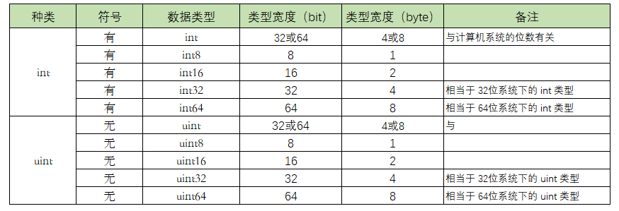

# 1.3、基本数据类型
Go语言中有丰富的数据类型，除了基本的整型、浮点型、布尔型、字符串外，还有数组、切片、结构体、函数、map、通道（channel）等。Go 语言的基本类型和其他语言大同小异。

## 基本数据类型

### 整形

整型分为以下两个大类： 
按长度分为：int8、int16、int32、int64 对应的无符号整型：uint8、uint16、uint32、uint64

其中，uint8就是我们熟知的byte型，int16对应C语言中的short型，int64对应C语言中的long型。



##### 特殊整形：

|  类型   | 符号 |      描述       |
| ------- | --- | -------------- |
| uintptr | 无   | 用于存放一个指针 |

#### 解释这个符号的区别

int 和 uint 的区别就在于一个 u，有 u 说明是无符号，没有 u 代表有符号。 

以 int8 和 uint8 举例，8 代表 8个bit，能表示的数值个数有 2^8 = 256。

uint8 是无符号，能表示的都是正数，0-255，刚好256个数。

int8 是有符号，既可以正数，也可以负数，那怎么办？对半分呗，-128-127，也刚好 256个数。

int8 int16 int32 int64 这几个类型的最后都有一个数值，这表明了它们能表示的数值个数是固定的。

而 int 并没有指定它的位数，说明它的大小，是可以变化的，那根据什么变化呢？
```
    当你在32位的系统下，int 和 uint 都占用 4个字节，也就是32位。

    若你在64位的系统下，int 和 uint 都占用 8个字节，也就是64位。
```
出于这个原因，在某些场景下，应当避免使用 int 和 uint ，而使用更加精确的 int32 和 int64，比如在二进制传输、读写文件的结构描述（为了保持文件的结构不会受到不同编译目标平台字节长度的影响）

###### 注意事项:
获取对象的长度的内建len()函数返回的长度可以根据不同平台的字节长度进行变化。
实际使用中，切片或 map 的元素数量等都可以用int来表示。
在涉及到二进制传输、读写文件的结构描述时，为了保持文件的结构不会受到不同编译目标平台字节长度的影响，不要使用int和 uint。

#### 数字字面量语法
Go1.13版本之后引入了数字字面量语法，这样便于开发者以二进制、八进制或十六进制浮点数的格式定义数字，例如：

`v := 0b00101101`， 代表二进制的 101101，相当于十进制的 45。
`v := 0o377`，代表八进制的 377，相当于十进制的 255。 
`v := 0x1p-2`，代表十六进制的 1 除以 2²，也就是 0.25。

而且还允许我们用` _ `来分隔数字，比如说:
`v := 123_456` 表示 v 的值等于 123456。

我们可以借助fmt函数来将一个整数以不同进制形式展示。

```
package main
 
import "fmt"
 
func main(){
	// 十进制
	var a int = 10
	fmt.Printf("%d \n", a)  // 10
	fmt.Printf("%b \n", a)  // 1010  占位符%b表示二进制
 
	// 八进制  以0开头
	var b int = 077
	fmt.Printf("%o \n", b)  // 77
 
	// 十六进制  以0x开头
	var c int = 0xff
	fmt.Printf("%x \n", c)  // ff
	fmt.Printf("%X \n", c)  // FF
}
```
出于习惯，在初始化数据类型为整型的变量时，我们会使用10进制的表示法，因为它最直观，比如这样，表示整数10.
```
var num int = 10
```

2进制：以`0b`或`0B`为前缀
```
var num01 int = 0b1100
```

8进制：以`0o`或者`0O`为前缀
```
var num02 int = 0o14
```

16进制：以`0x` 为前缀
```
var num03 int = 0xC
```
下面用一段代码分别使用二进制、8进制、16进制来表示 10 进制的数值：12

```
package main

import (
    "fmt"
)

func main() {
    var num01 int = 0b1100
    var num02 int = 0o14
    var num03 int = 0xC

    fmt.Printf("2进制数 %b 表示的是: %d \n", num01, num01)
    fmt.Printf("8进制数 %o 表示的是: %d \n", num02, num02)
    fmt.Printf("16进制数 %X 表示的是: %d \n", num03, num03)
}
```

输出如下：
```
2进制数 1100 表示的是: 12
8进制数 14 表示的是: 12
16进制数 C 表示的是: 12
```

常用进制表示方法：
```
%b    表示为二进制
%c    该值对应的unicode码值
%d    表示为十进制
%o    表示为八进制
%q    该值对应的单引号括起来的go语法字符字面值，必要时会采用安全的转义表示
%x    表示为十六进制，使用a-f
%X    表示为十六进制，使用A-F
%U    表示为Unicode格式：U+1234，等价于"U+%04X"
%E    用科学计数法表示
%f    用浮点数表示
```

### 浮点型

浮点数类型的值一般由整数部分、小数点`.`和小数部分组成。
其中，整数部分和小数部分均由10进制表示法表示。不过还有另一种表示方法。那就是在其中加入指数部分。指数部分由`E`或`e`以及一个带正负号的10进制数组成。比如，`3.7E-2`表示浮点数`0.037`。又比如，`3.7E+1`表示浮点数`37`。
有时候，浮点数类型值的表示也可以被简化。比如，`37.0`可以被简化为`37`。又比如，`0.037`可以被简化为`.037`。
有一点需要注意，在Go语言里，浮点数的相关部分只能由10进制表示法表示，而不能由8进制表示法或16进制表示法表示。比如，03.7表示的一定是浮点数3.7。

Go语言支持两种浮点型数：`float32`和`float64`。
float32，也即我们常说的单精度，存储占用4个字节，也即`4*8=32`位，其中1位用来符号，8位用来指数，剩下的23位表示尾数


float64，也即我们熟悉的双精度，存储占用8个字节，也即8*8=64位，其中1位用来符号，11位用来指数，剩下的52位表示尾数


#### 那么精度是什么意思？有效位有多少位？

精度主要取决于尾数部分的位数。

对于 float32（单精度）来说，表示尾数的为23位，除去全部为0的情况以外，最小为2^-23，约等于1.19*10^-7，所以float小数部分只能精确到后面6位，加上小数点前的一位，即有效数字为7位。

同理 float64（单精度）的尾数部分为 52位，最小为2^-52，约为2.22*10^-16，所以精确到小数点后15位，加上小数点前的一位，有效位数为16位。

通过以上，可以总结出以下几点：

##### 一、float32 和 float64 可以表示的数值很多
这两种浮点型数据格式遵循IEEE 754标准： 

浮点数类型的取值范围可以从很微小到很巨大。浮点数取值范围的极限值可以在 math 包中找到：
```
    常量 math.MaxFloat32 表示 float32 能取到的最大数值，大约是 3.4e38；

    常量 math.MaxFloat64 表示 float64 能取到的最大数值，大约是 1.8e308；

    float32 和 float64 能表示的最小值分别为 1.4e-45 和 4.9e-324。
```
##### 二、数值很大但精度有限

人家虽然能表示的数值很大，但精度位却没有那么大。
```
    float32的精度只能提供大约6个十进制数（表示后科学计数法后，小数点后6位）的精度

    float64的精度能提供大约15个十进制数（表示后科学计数法后，小数点后15位）的精度
```
这里的精度是什么意思呢？

比如 10000018这个数，用 float32 的类型来表示的话，由于其有效位是7位，将10000018 表示成科学计数法，就是 1.0000018 * 10^7，能精确到小数点后面6位。

此时用科学计数法表示后，小数点后有7位，刚刚满足我们的精度要求，意思是什么呢？此时你对这个数进行+1或者-1等数学运算，都能保证计算结果是精确的
```
package main
import "fmt"
var myfloat float32 = 10000018
func main()  {
    fmt.Println("myfloat: ", myfloat)
    fmt.Println("myfloat: ", myfloat+1)
}
```
输出如下
```
myfloat:  1.0000018e+07
myfloat:  1.0000019e+07
```
上面举了一个刚好满足精度要求数据的临界情况，为了做对比，下面也举一个刚好不满足精度要求的例子。只要给这个数值多加一位数就行了。

换成 100000187，同样使用 float32类型，表示成科学计数法，由于精度有限，表示的时候小数点后面7位是准确的，但若是对其进行数学运算，由于第八位无法表示，所以运算后第七位的值，就会变得不精确。

这里我们写个代码来验证一下，按照我们的理解下面 myfloat01 = 100000182 ，对其+5 操作后，应该等于 myfloat02 = 100000187，
```
package main
import "fmt"

var myfloat01 float32 = 100000182
var myfloat02 float32 = 100000187

func main() {
    fmt.Println("myfloat: ", myfloat01)
    fmt.Println("myfloat: ", myfloat01+5)
    fmt.Println(myfloat02 == myfloat01+5)
}
```
但是由于其类型是 float32，精度不足，导致最后比较的结果是不相等（从小数点后第七位开始不精确）
```
myfloat:  1.00000184e+08
myfloat:  1.0000019e+08
false
```
由于精度的问题，就会出现这种很怪异的现象，`myfloat == myfloat +1` 会返回 `true`。

打印浮点数时，可以使用fmt包配合动词`%f`，代码如下：
```
package main
import (
        "fmt"
        "math"
)
func main() {
        fmt.Printf("%f\n", math.Pi)
        fmt.Printf("%.2f\n", math.Pi)
}
```
输出如下：
```
3.141593
3.14
```


### byte、rune

组成每个字符串的元素叫做“字符”，可以通过遍历或者单个获取字符串元素获得字符。 字符用单引号（’）包裹起来，如：
```
var a := '中'
var b := 'x'
```
##### Go 语言的字符有以下两种：
```
    uint8类型，或者叫 byte 型，代表了ASCII码的一个字符。
    rune类型，代表一个 UTF-8字符。
```
`byte`，占用1个节字，就 8 个比特位，所以它和 uint8 类型本质上没有区别，它表示的是 ACSII 表中的一个字符。

如下这段代码，分别定义了 byte 类型和 uint8 类型的变量 a 和 b
```
package main
import "fmt"

func main() {
    var a byte = 65
    // 8进制写法: var c byte = '\101'     其中 \ 是固定前缀
    // 16进制写法: var c byte = '\x41'    其中 \x 是固定前缀

    var b uint8 = 66
    fmt.Printf("a 的值: %c \nb 的值: %c", a, b)
    // 或者使用 string 函数
    // fmt.Println("a 的值: ", string(a)," \nb 的值: ", string(b))
}
```
在 ASCII 表中，由于字母 A 的ASCII 的编号为 65 ，字母 B 的ASCII 编号为 66，所以上面的代码也可以写成这样
```
package main
import "fmt"

func main() {
    var a byte = 'A'
    var b uint8 = 'B'
    fmt.Printf("a 的值: %c \nb 的值: %c", a, b)
}
```
他们的输出结果都是一样的。
```
a 的值: A
b 的值: B
```
rune，占用4个字节，共32位比特位，所以它和 uint32 本质上也没有区别。它表示的是一个 Unicode字符（Unicode是一个可以表示世界范围内的绝大部分字符的编码规范）。

当需要处理中文、日文或者其他复合字符时，则需要用到rune类型。rune类型实际是一个int32。

Go 使用了特殊的 rune 类型来处理 Unicode，让基于 Unicode 的文本处理更为方便，也可以使用 byte 型进行默认字符串处理，性能和扩展性都有照顾。

```
// 遍历字符串
func traversalString() {
	s := "hello沙河"
	for i := 0; i < len(s); i++ { //byte
		fmt.Printf("%v(%c) ", s[i], s[i])
	}
	fmt.Println()
	for _, r := range s { //rune
		fmt.Printf("%v(%c) ", r, r)
	}
	fmt.Println()
}
```
输出如下：
```
104(h) 101(e) 108(l) 108(l) 111(o) 230(æ) 178(²) 153() 230(æ) 178(²) 179(³) 
104(h) 101(e) 108(l) 108(l) 111(o) 27801(沙) 27827(河) 
```


```
import (
    "fmt"
    "unsafe"
)

func main() {
    var a byte = 'A'
    var b rune = 'B'
    fmt.Printf("a 占用 %d 个字节数\nb 占用 %d 个字节数", unsafe.Sizeof(a), unsafe.Sizeof(b))
}
```
输出如下：
```
a 占用 1 个字节数
b 占用 4 个字节数
```

因为UTF8编码下一个中文汉字由3~4个字节组成，所以我们不能简单的按照字节去遍历一个包含中文的字符串，否则就会出现上面输出中第一行的结果。

字符串底层是一个byte数组，所以可以和[]byte类型相互转换。字符串是不能修改的 字符串是由byte字节组成，所以字符串的长度是byte字节的长度。 rune类型用来表示utf8字符，一个rune字符由一个或多个byte组成。

这里一定要注意了，在 Go 中单引号与 双引号并不是等价的。
单引号用来表示字符，在上面的例子里，如果你使用双引号，就意味着你要定义一个字符串，赋值时与前面声明的前面会不一致，这样在编译的时候就会出错。

### 字符串