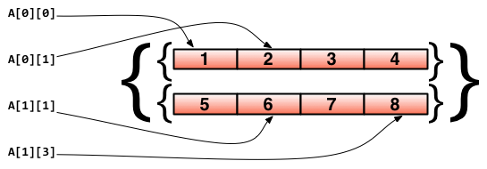

# 1.6、数组

数组是一个具有相同唯一类型的由固定长度的连续的元素组成的序列，一个数组可以由零个或多个元素组成。
数组长度必须是一个常量表达式，并且必须是一个非负整数。
这些元素可以是内建类型，像数字和字符串，也可以是结构类型，元素可以通过唯一的索引值访问，从0开始。
因为数组的长度是固定的，所以在Go语言中很少直接使用数组。
声明数组，并给该数组里的每个元素赋值（索引值的最小有效值和其他大多数语言一样是 0，不是1）
数组是很有价值的数据结构，因为它的内存分配是连续的，内存连续意味着可以让它在CPU缓存中待更久，所以迭代数组和移动元素都会非常迅速。

> 在Go语言中，数组从声明时就确定，使用时可以修改数组成员，但是数组大小不可变化

基本语法：
```
var 数组变量名 [元素数量]T
```

### 数组的声明

// 定义一个长度为3，元素类型为`Int`的数组arr
这里的3 ，表示该数组的元素个数及容量

```
var arr [3]int
arr[0] = 1
arr[1] = 2
arr[2] = 3
```

声明并直接初始化数组
```
var arr [3]int = [3]int{1,2,3}      //定义长度为3的元素类型为Int的整型数组并初始化，很少这样使用
arr2 [5]int := [5]int{1,2,3,4,5}	//定义并初始化
arr3 := [5]int{1,2,3,4,5}			//自动推导并初始化
arr4 := [5]int{1,2}					//指定总长度，前几位被初始化，没有的使用零值
arr5 := [5]int{2:10, 4:11}			//有选择的初始化，没被初始化的使用零值
arr6 := [...]int{2,3,4}				//自动计算长度(使用 `...` 让Go语言自己根据实际情况来分配索引长度)
```

如果数组值已经提前知道了，那么可以通过 `数组常量` 的方法来初始化数组，而不用依次使用 `[]=` 方法（所有的组成元素都有相同的常量语法）。

**注意：** 数组的长度必须是常量，并且长度是数组类型的一部分。一旦定义，长度不能变。
比如：
```
var arr1 [5]int
var arr2 [10]int
```
这里面，`[5]int`和`[10]int`就是不同的类型，使用 `fmt` 的 `%T` 可以查得

```
import (
	"fmt"
)

func main() {
	arr1 := [5]int{1,2,3,4,5}
	arr2 := [10]int{1,2,3,4,5,6,7,8,9,10}
	fmt.Printf("%d 的类型是: %T\n", arr1, arr1)
	fmt.Printf("%d 的类型是: %T", arr2, arr2)
}
```

输出如下：
```
[1 2 3 4 5] 的类型是: [5]int
[1 2 3 4 5 6 7 8 9 10] 的类型是: [10]int
```

在内存中的结构是：
每个元素是一个整型值，当声明数组时所有的元素都会被自动初始化为默认值 0。
arr1 的长度是 5，索引下标范围从 `0` 到 `len(arr1)-1`。
第一个元素是 `arr1[0]`，第三个元素是 `arr1[2]`；总体来说索引 `i` 代表的元素是 `arr1[i]`，最后一个元素是 `arr1[len(arr1)-1]`。
对索引项为 `i` 的数组元素赋值可以这么操作：`arr[i] = value`，所以数组是可变的。
只有有效的索引可以被使用，当使用等于或者大于 `len(arr1)` 的索引即访问越界（下标在合法范围之外）时：如果编译器可以检测到，会给出索引超限的提示信息即触发访问越界，会`panic`；

```
runtime error: index out of range
```


**注意：**
当一个数组被声明时，它里面包含的每个元素都会被初始化为该元素类型的默认值。
一旦数组被声明了，那么它的数据类型跟长度都不能再被改变。
如果你需要更多的元素，那么只能创建一个你想要长度的新的数组，然后把原有数组的元素拷贝过去。

### 数组常用操作
```
arr[:]      代表所有元素
arr[:5]     代表前五个元素，即区间的左闭右开
arr[5:]     代表从第5个开始（不包含第5个）
len(arr)    数组的长度
```
**贴士：** 上述操作会引发类型的变化，数组将会转化为Go中新的数据类型`slice`


### 数组的遍历

由于索引的存在，遍历数组的方法自然就是使用 `for` 结构:

- 通过 for 初始化数组项
- 通过 for 打印数组元素
- 通过 for 依次处理元素


方式一：for循环遍历
```
import "fmt"

func main() {
	var arr1 [5]int

	for i:=0; i < len(arr1); i++ {
		arr1[i] = i * 2
	}

	for i:=0; i < len(arr1); i++ {
		fmt.Printf("Array at index %d is %d\n", i, arr1[i])
	}
}
```

输出如下：
```
Array at index 0 is 0
Array at index 1 is 2
Array at index 2 is 4
Array at index 3 is 6
Array at index 4 is 8
```

方式二：for-range遍历
```
arr := [3]int{1,2,3}

for k, v := range arr {
	fmt.Println(k)	//元素位置
	fmt.Println(v)	//元素值
}
```

**Go** 语言中的数组是一种 `值类型`（不像 `C/C++` 中是指向首元素的指针），所以可以通过 `new()` 来创建： `var arr1 = new([5]int)`。

那么这种方式和 `var arr2 [5]int` 的区别是什么呢？`arr1` 的类型是 `*[5]int`，而 `arr2`的类型是 `[5]int`。

这样的结果就是当把一个数组赋值给另一个时，需要再做一次数组内存的拷贝操作。例如：

`arr2 := *arr1`
`arr2[2] = 100`

这样两个数组就有了不同的值，在赋值后修改 `arr2` 不会对 `arr1` 生效。

- 数组支持 `==`、`!=` 操作符，因为内存总是被初始化过的。
- `[n]*`T表示指针数组，`*[n]`T表示数组指针 。

所以在函数中数组作为参数传入时，如` func1(arr2)`，会产生一次数组拷贝，`func1` 方法不会修改原始的数组 `arr2`。


如果你想修改原数组，那么 `arr2` 必须通过`&`操作符以引用方式传过来，例如 `func1(&arr2)`，下面是一个例子：
```
import "fmt"

func f(a [3]int)  {
	fmt.Println(a)
}

func fp(a *[3]int)  {
	fmt.Println(a)
}

func main() {
	var ar [3]int
	f(ar)
	fp(&ar)
}
```

输出如下：
```
[0 0 0]
&[0 0 0]
```
另一种方法就是生成数组切片并将其传递给函数

**问题1**：怎么证明当数组赋值时，发生了数组内存拷贝？

证明如下：
```
package main

import "fmt"

func main() {
   var arr1 [5] int
   
   for i:=0;i<len(arr1);i++ {
   	arr1[i] = i * 2
   }
   
   arr2 := arr1
   arr2[2] = 100

	for i:=0;i<len(arr1);i++ {
		fmt.Println("Array arr1 at index %d is %d\\n",i,arr1[i])
	}
	fmt.Println()

	for i:=0;i<len(arr2);i++ {
		fmt.Println("Array arr2 at index %d is %d\\n",i,arr2[i])
	}
}
```
输出如下：
```
Array arr1 at index %d is %d\n 0 0
Array arr1 at index %d is %d\n 1 2
Array arr1 at index %d is %d\n 2 4
Array arr1 at index %d is %d\n 3 6
Array arr1 at index %d is %d\n 4 8

Array arr2 at index %d is %d\n 0 0
Array arr2 at index %d is %d\n 1 2
Array arr2 at index %d is %d\n 2 100
Array arr2 at index %d is %d\n 3 6
Array arr2 at index %d is %d\n 4 8

```

**问题2：** 怎么利用下标给数组赋值（从 0 到 15）

```
package main

import "fmt"

func main() {
   var arr [15]int

	for i:=0;i<len(arr);i++ {
		arr[i]=i
		fmt.Println("arr数组下标为：",i,"arr数组值为：",arr[i])
	}
	fmt.Println()
	fmt.Println("arr数组值为：",arr)
}
```

输出如下：
```
arr数组下标为： 0 arr数组值为： 0
arr数组下标为： 1 arr数组值为： 1
arr数组下标为： 2 arr数组值为： 2
arr数组下标为： 3 arr数组值为： 3
arr数组下标为： 4 arr数组值为： 4
arr数组下标为： 5 arr数组值为： 5
arr数组下标为： 6 arr数组值为： 6
arr数组下标为： 7 arr数组值为： 7
arr数组下标为： 8 arr数组值为： 8
arr数组下标为： 9 arr数组值为： 9
arr数组下标为： 10 arr数组值为： 10
arr数组下标为： 11 arr数组值为： 11
arr数组下标为： 12 arr数组值为： 12
arr数组下标为： 13 arr数组值为： 13
arr数组下标为： 14 arr数组值为： 14

arr数组值为： [0 1 2 3 4 5 6 7 8 9 10 11 12 13 14]

```

### 多维数组
数组通常是一维的，但是可以用来组装成多维数组，例如：`[3][5]int`，`[2][2][2]float64`。

内部数组总是长度相同的。Go 语言的多维数组是矩形式的（唯一的例外是切片的数组）

```
// 声明了一个二维数组，该数组以两个数组作为元素，其中每个数组中又有4个int类型的元素
doubleArray := [2][4]int{[4]int{1, 2, 3, 4}, [4]int{5, 6, 7, 8}}

// 上面的声明可以简化，直接忽略内部的类型
easyArray := [2][4]int{{1, 2, 3, 4}, {5, 6, 7, 8}}
```
数组的分配如下所示：


示例一：

```
package main

import "fmt"

func main()  {
	a := [3][2]string{
		{"北京","上海"},
		{"广州","深圳"},
		{"成都","重庆"},
	}

   fmt.Println(a)
   fmt.Println(a[2][1])
}

```

输出如下：
```
[[北京 上海] [广州 深圳] [成都 重庆]]
重庆
```

示例二：
```
package main

import (
	"fmt"
)

func main()  {
	a := [3][2]string{
		{"北京","上海"},
		{"广州","深圳"},
		{"成都","重庆"},
	}

	for _,v1 := range a{
		for _,v2:=range v1 {
		fmt.Printf("%s\t",v2)
	}
		fmt.Println()
	}
}

```
输出如下：
```
北京	上海
广州	深圳
成都	重庆
```


```
func modifyArray(x [3]int) {
	x[0] = 100
}

func modifyArray2(x [3][2]int) {
	x[2][0] = 100
}
func main() {
	a := [3]int{10, 20, 30}
	modifyArray(a) //在modify中修改的是a的副本x
	fmt.Println(a)
	b := [3][2]int{
		{1, 1},
		{1, 1},
		{1, 1},
	}
	modifyArray2(b) //在modify中修改的是b的副本x
	fmt.Println(b)
}
```

输出如下：
```
[10 20 30]
[[1 1] [1 1] [1 1]]
```


注意： 多维数组只有第一层可以使用`...`来让编译器推导数组长度。例如：

```
//支持的写法
a := [...][2]string{
	{"北京", "上海"},
	{"广州", "深圳"},
	{"成都", "重庆"},
}
//不支持多维数组的内层使用...
b := [3][...]string{
	{"北京", "上海"},
	{"广州", "深圳"},
	{"成都", "重庆"},
}
```


### 将数组传递给函数

把一个大数组传递给函数会消耗很多内存。有两种方法可以避免这种现象：

- 传递数组的指针
- 使用数组的切片

接下来的例子阐明了第一种方法：
```
package main
import "fmt"

func main() {
	array := [3]float64{7.0, 8.5, 9.1}
	x := Sum(&array)
	fmt.Printf("The sum of the array is: %f", x)
}

func Sum(a *[3]float64) (sum float64) {
	for _, v := range a {
		sum += v
	}
	return
}
```
输出结果：
```
The sum of the array is: 24.600000
```

但这在 Go 中并不常用，通常使用切片。


### 数组使用注意事项

- 数组创建完长度就固定，不可以再追加元素；
- 长度是数组类型的一部分，因此[3]int与[4]int是不同的类型；
- 数组之间的赋值是值的赋值，即当把一个数组作为参数传入函数的时候，传入的其实是该函数的副本，而不是他的指针。