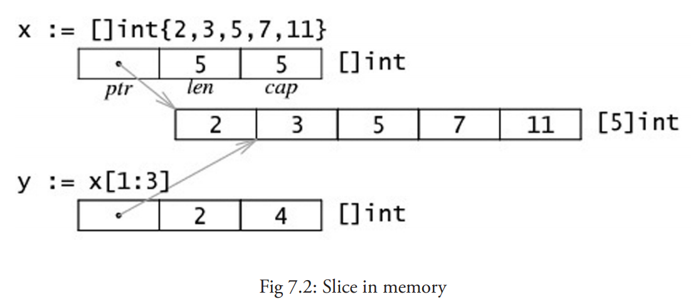

# 1.6.2、切片

## 切片的定义
切片（Slice）是一个拥有相同类型元素的可变长度的序列，一般用于快速地操作一块数据集合。它是基于数组类型做的一层封装。它非常灵活，支持自动扩容。与数组一样，也是可以容纳若干类型相同的元素的容器。与数组不同的是，无法通过切片类型来确定其值的长度。每个切片值都会将数组作为其底层数据结构。我们也把这样的数组称为切片的底层数组。

声明切片类型的基本语法如下：
```
var name []T （不需要说明长度）
```

其中：
- `name`:表示变量名
- `T`:表示切片中的元素类型
- 一个切片在未初始化之前默认为 `nil`，长度为 0。

```
import (
    "fmt"
)

func main() {
    myarr := [...]int{1, 2, 3}
    fmt.Printf("%d 的类型是: %T", myarr[0:2], myarr[0:2])
}
```
输出 如下
```
[1 2] 的类型是: []int
```

切片是一个引用类型，它的底层就是一个长度可变的数组，是对数组的一个连续片段的引用（该数组我们称之为相关数组，通常是匿名的，所以我们可以基于数组通过切片表达式得到切片。），所以切片是一个引用类型（因此更类似于 `C/C++` 中的数组类型，或者 `Python` 中的 `list` 类型）。它的内部结构包含地址、长度和容量。这个片段可以是整个数组，也可以是由起始和终止索引标识的一些项的子集。需要注意的是，终止索引标识的项不包括在切片内（意思是这是个左闭右开的区间）。给定项的切片索引可能比相关数组的相同元素的索引小。和数组不同的是，切片的长度可以在运行时修改，由 `len()` 函数获取长度，最小为 0， 最大为相关数组的长度。可以说切片提供了一个相关数组的动态窗口。

切片提供了计算容量的函数 `cap()` 可以测量切片最长可以达到多少：它等于切片的长度 `+` 数组除切片之外的长度。如果 `s` 是一个切片，`cap(s)` 就是从 `s[0]` 到数组末尾的数组长度。切片的长度永远不会超过它的容量，所以对于 切片 `s` 来说，该不等式永远成立：`0 <= len(s) <= cap(s)`。

多个切片如果表示同一个数组的片段，它们可以共享数据；因此一个切片和相关数组的其他切片是共享存储的，相反，不同的数组总是代表不同的存储。数组实际上是切片的构建块。

**优点：
因为切片是引用，所以它们不需要使用额外的内存并且比使用数组更有效率，所以在 Go 代码中 切片比数组更常用。**

切片的初始化格式是：`var slice1 []type = arr1[start:end]`。

这表示 `slice1` 是由数组 `arr1` 从 `start` 索引到 `end-1` 索引之间的元素构成的子集（切分数组，`start:end` 被称为 `slice` 表达式）。所以 `slice1[0] `就等于 `arr1[start]`。这可以在 `arr1` 被填充前就定义好。

如果某个人写：`var slice1 []type = arr1[:]` 那么` slice1 `就等于完整的 `arr1` 数组（所以这种表示方式是 `arr1[0:len(arr1)]` 的一种缩写）。

另外一种表述方式是：`slice1 = &arr1`。

**注意 绝对不要用指针指向 slice。切片本身已经是一个引用类型，所以它本身就是一个指针!!**

`arr1[2:]` 和 `arr1[2:len(arr1)]` 相同，都包含了数组从第三个到最后的所有元素。

`arr1[:3]` 和 `arr1[0:3]` 相同，包含了从第一个到第三个元素（不包括第四个）。

如果你想去掉`slice1`的最后一个元素，只要 `slice1 = slice1[:len(slice1)-1]`。

一个由数字 1、2、3 组成的切片可以这么生成：`s := [3]int{1,2,3}[:]`(注: 应先用`s := [3]int{1, 2, 3}`生成数组, 再使用`s[:]`转成切片) 甚至更简单的 `s := []int{1,2,3}`。

`s2 := s[:]` 是用切片组成的切片，拥有相同的元素，但是仍然指向相同的相关数组。

一个切片 s 可以这样扩展到它的大小上限：`s = s[:cap(s)]`，如果再扩大的话就会导致运行时错误。

对于每一个切片（包括 `string`），以下状态总是成立的：

```
s == s[:i] + s[i:] // i是一个整数且: 0 <= i <= len(s)
len(s) <= cap(s)
```

**注意：
对于数组或字符串，如果0 <= low <= high <= len(a)，则索引合法，否则就会索引越界（out of range）。**

切片也可以用类似数组的方式初始化：`var x = []int{2, 3, 5, 7, 11}`。这样就创建了一个长度为 5 的数组并且创建了一个相关切片。

切片在内存中的组织方式实际上是一个有 3 个域的结构体：指向相关数组的指针，切片长度以及切片容量。下图给出了一个长度为 2，容量为 4 的切片y。

```
y[0] = 3 且 y[1] = 5。
切片 y[0:4] 由 元素 3，5，7 和 11 组成。
```



示例如下：

```
// 声明一个含有10个元素元素类型为byte的数组
var ar = [10]byte {'a', 'b', 'c', 'd', 'e', 'f', 'g', 'h', 'i', 'j'}

// 声明两个含有byte的slice
var a, b []byte

// a指向数组的第3个元素开始，并到第五个元素结束，
a = ar[2:5]
//现在a含有的元素: ar[2]、ar[3]和ar[4]

// b是数组ar的另一个slice
b = ar[3:5]
// b的元素是：ar[3]和ar[4]

//声明一个字符串切片
var a []string

//声明一个整型切片并初始化
var b = []int{}

//声明一个布尔切片并初始化
var c = []bool{false, true}

//声明一个布尔切片并初始化
var d = []bool{false, true}
```


对切片再切片时，`end`的上限边界是切片的容量`cap(a)`，而不是长度。常量索引必须是非负的，并且可以用`int`类型的值表示;

对于数组或常量字符串，常量索引也必须在有效范围内。如果`start`和`end`两个指标都是常数，它们必须满足`start` <= `end`。如果索引在运行时超出范围，就会发生运行时`panic`。

```
func main() {
	a := [5]int{1, 2, 3, 4, 5}
	s := a[1:3]  // s := a[start:end]
	fmt.Printf("s:%v len(s):%v cap(s):%v\n", s, len(s), cap(s))
	s2 := s[3:4]  // 索引的上限是cap(s)而不是len(s)
	fmt.Printf("s2:%v len(s2):%v cap(s2):%v\n", s2, len(s2), cap(s2))
}
```

输出如下：
```
s:[2 3] len(s):2 cap(s):4
s2:[5] len(s2):1 cap(s2):1
```


## 切片的构造

切片的构造，有四种方式

1、对数组进行片段截取（上面例子已经展示：`myarr[0:2]`，0是索引起始值，2是索引终止值，区间左闭右开），当你使用这种方式生成切片对象时，切片的容量会从截取的起始索引到原数组的终止索引

```
// 定义一个数组
myarr := [5]int{1,2,3,4,5}

// 【第一种】
// 1 表示从索引1开始，直到到索引为 2 (3-1)的元素
mysli1 := myarr[1:3]

// 【第二种】
// 1 表示从索引1开始，直到到索引为 2 (3-1)的元素
mysli2 := myarr[1:3:4]
```
如果你把上面的 `mysli1` 和 `mysli2` 打印出来，会发现他们居然是一样的。那第二种的 `myarr[1:3:4]` 的 4有什么用呢？

在切片时，若不指定第三个数，那么切片终止索引会一直到原数组的最后一个数。而如果指定了第三个数，那么切片终止索引只会到原数组的该索引值。

用下面这段代码来验证一下
```
package main
import "fmt"

func main(){
    myarr := [5]int{1,2,3,4,5}
    fmt.Printf("myarr 的长度为：%d，容量为：%d\n", len(myarr), cap(myarr))

    mysli1 := myarr[1:3]
    fmt.Printf("mysli1 的长度为：%d，容量为：%d\n", len(mysli1), cap(mysli1))
    fmt.Println(mysli1)

    mysli2 := myarr[1:3:4]
    fmt.Printf("mysli2 的长度为：%d，容量为：%d\n", len(mysli2), cap(mysli2))
    fmt.Println(mysli2)
}
```

输出如下，说明切片的第三个数，影响的只是切片的容量，而不会影响长度

```
myarr 的长度为：5，容量为：5
mysli1 的长度为：2，容量为：4
[2 3]
mysli2 的长度为：2，容量为：3
[2 3]
```


2、从头声明赋值（例子如下）
```
// 声明字符串切片
var strList []string

// 声明整型切片
var numList []int

// 声明一个空切片
var numListEmpty = []int{}
```


3、使用 `make` 函数构造，`make` 函数的格式：`make( []Type, size, cap )`
这个函数刚好指出了，一个切片具备的三个要素：`类型（Type），长度（size），容量（cap）`


```
import (
    "fmt"
)
func main() {
    a := make([]int, 2)
    b := make([]int, 2, 10)
    fmt.Println(a, b)
    fmt.Println(len(a), len(b))
    fmt.Println(cap(a), cap(b))
}
```


输出 如下
```
[0 0] [0 0]
2 2
2 10
```


4、使用和数组一样，偷懒的方法
```
import (
    "fmt"
)
func main() {
    a := []int{4:2}
    fmt.Println(a)
    fmt.Println(len(a), cap(a))
}
```
输出如下
```
[0 0 0 0 2]
5 5
```


关于 len 和 cap 的概念，可能不好理解 ，这里举个例子：
- 公司名，相当于字面量，也就是变量名。
- 公司里的所有工位，相当于已分配到的内存空间
- 公司里的员工，相当于元素
- `cap` 代表你这个公司最多可以容纳多少员工
- `len` 代表你这个公司当前有多少个员工
- 由于 切片是引用类型，所以你不对它进行赋值的话，它的零值（默认值）是 `nil`


```
var myarr []int
fmt.Println(myarr == nil)
// true
```


数组 与 切片 有相同点，它们都是可以容纳若干类型相同的元素的容器
也有不同点，数组的容器大小固定，而切片本身是引用类型，它更像是 `Python` 中的 `list` ，我们可以对它 `append` 进行元素的添加。


```
import (
    "fmt"
)
func main() {
    myarr := []int{1}
    // 追加一个元素
    myarr = append(myarr, 2)
    // 追加多个元素
    myarr = append(myarr, 3, 4)
    // 追加一个切片, ... 表示解包，不能省略
    myarr = append(myarr, []int{7, 8}...)
    // 在第一个位置插入元素
    myarr = append([]int{0}, myarr...)
    // 在中间插入一个切片(两个元素)
    myarr = append(myarr[:5], append([]int{5,6}, myarr[5:]...)...)
    fmt.Println(myarr)
}
```


输出 如下
```
[0 1 2 3 4 5 6 7 8]
```


思考:
```
package main

import (
    "fmt"
)

func main() {
    var numbers4 = [...]int{1, 2, 3, 4, 5, 6, 7, 8, 9, 10}
    myslice := numbers4[4:6:8]
    fmt.Printf("myslice为 %d, 其长度为: %d\n", myslice, len(myslice))
    myslice = myslice[:cap(myslice)]
    fmt.Printf("myslice的第四个元素为: %d", myslice[3])
}
```
为什么 `myslice` 的长度为2，却能访问到第四个元素
`myslice`为 `[5 6]`, 其长度为: `2`
`myslice`的第四个元素为: `8`


### 指针与切片

切片与指针一样，都是引用类型。

如果我们想通过一个函数改变一个数组的值，有两种方法

1、将这个数组的切片做为参数传给函数

2、将这个数组的指针做为参数传给函数

尽管二者都可以实现目的，但是按照 Go 语言的使用习惯，建议使用第一种方法，因为第一种方法，写出来的代码会更加简洁，易读。

**1、使用切片**
```
func modify(sls []int) {
    sls[0] = 90
}

func main() {
    a := [3]int{89, 90, 91}
    modify(a[:])
    fmt.Println(a)
}
```
**2、使用指针**
```
func modify(arr *[3]int) {
    (*arr)[0] = 90
}

func main() {
    a := [3]int{89, 90, 91}
    modify(&a)
    fmt.Println(a)
}
```
