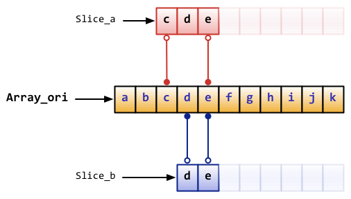
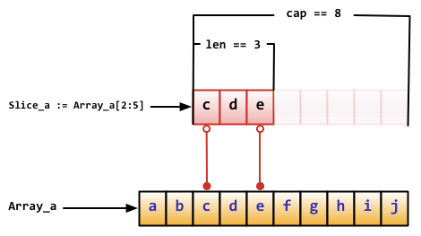
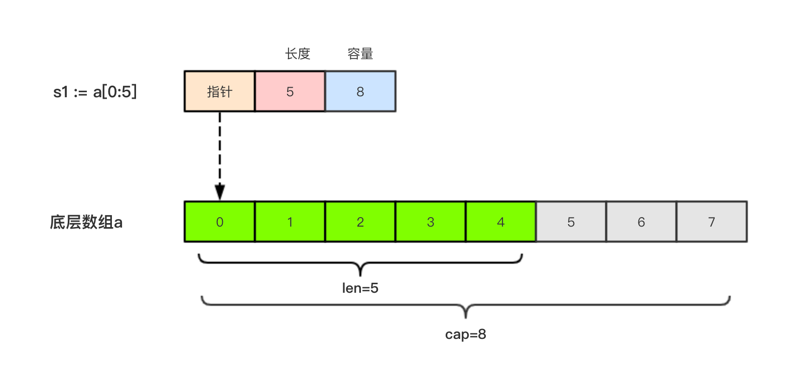
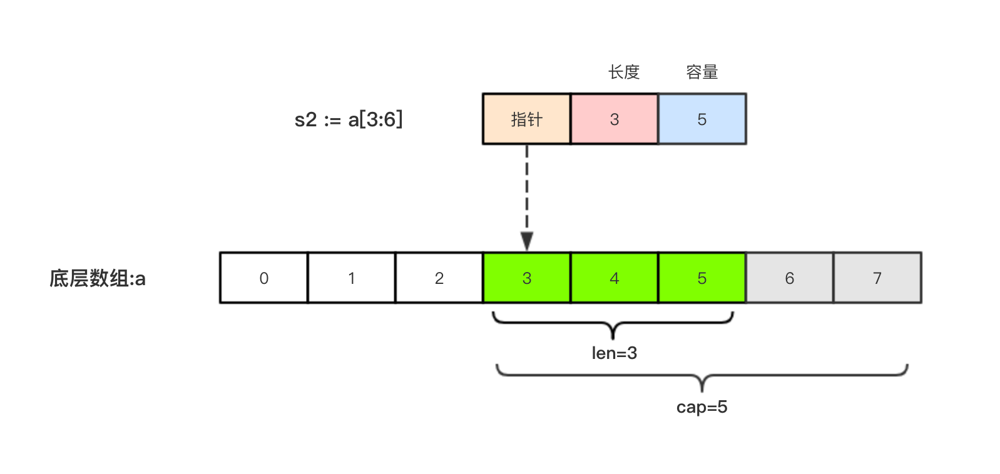
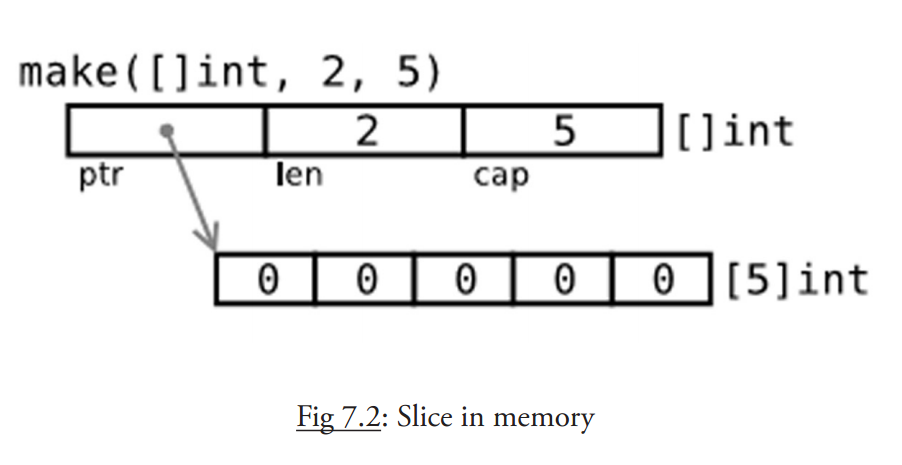
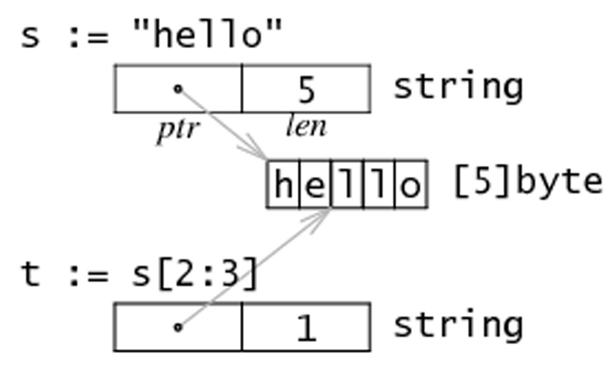
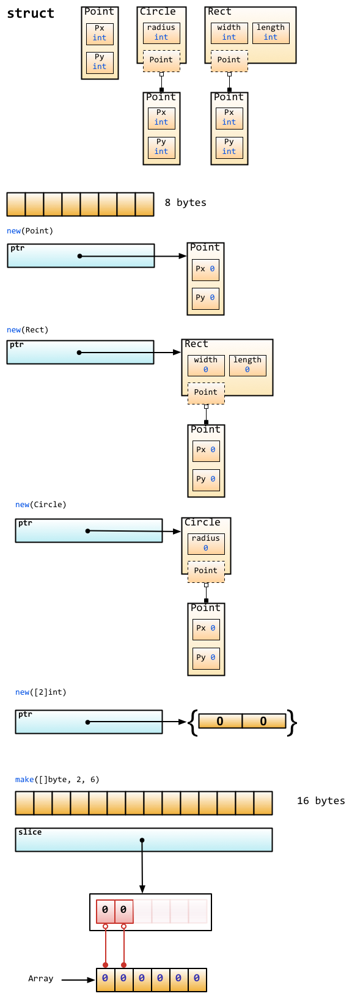

# 1.6.2、切片（slice）

## 切片的定义
切片（Slice）是一个拥有相同类型元素的可变长度的序列，一般用于快速地操作一块数据集合。它是基于数组类型做的一层封装。它非常灵活，支持自动扩容。与数组一样，也是可以容纳若干类型相同的元素的容器。与数组不同的是，无法通过切片类型来确定其值的长度。每个切片值都会将数组作为其底层数据结构。我们也把这样的数组称为切片的底层数组。

声明切片类型的基本语法如下：
```
var name []T （不需要说明长度）
```

其中：
- `name`:表示变量名
- `T`:表示切片中的元素类型
- 一个切片在未初始化之前默认为 `nil`，长度为 0。


切片是一个引用类型，它的底层就是一个长度可变的数组，是对数组的一个连续片段的引用（该数组我们称之为相关数组，通常是匿名的，所以我们可以基于数组通过切片表达式得到切片。），所以切片是一个引用类型（因此更类似于 `C/C++` 中的数组类型，或者 `Python` 中的 `list` 类型）。它的内部结构包含地址、长度和容量。这个片段可以是整个数组，也可以是由起始和终止索引标识的一些项的子集。需要注意的是，终止索引标识的项不包括在切片内（意思是这是个左闭右开的区间）。给定项的切片索引可能比相关数组的相同元素的索引小。和数组不同的是，切片的长度可以在运行时修改，由 `len()` 函数获取长度，最小为 0， 最大为相关数组的长度。可以说切片提供了一个相关数组的动态窗口。

切片提供了计算容量的函数 `cap()` 可以测量切片最长可以达到多少：它等于切片的长度 `+` 数组除切片之外的长度。如果 `s` 是一个切片，`cap(s)` 就是从 `s[0]` 到数组末尾的数组长度。切片的长度永远不会超过它的容量，所以对于 切片 `s` 来说，该不等式永远成立：`0 <= len(s) <= cap(s)`。

多个切片如果表示同一个数组的片段，它们可以共享数据；因此一个切片和相关数组的其他切片是共享存储的，相反，不同的数组总是代表不同的存储。数组实际上是切片的构建块。

**优点：
因为切片是引用，所以它们不需要使用额外的内存并且比使用数组更有效率，所以在 Go 代码中 切片比数组更常用。**

数组 与 切片 有相同点，它们都是可以容纳若干类型相同的元素的容器
也有不同点，数组的容器大小固定，而切片本身是引用类型。


切片的初始化格式是：`var slice1 []type = arr1[start:end]`。

这表示 `slice1` 是由数组 `arr1` 从 `start` 索引到 `end-1` 索引之间的元素构成的子集（切分数组，`start:end` 被称为 `slice` 表达式）。所以 `slice1[0] `就等于 `arr1[start]`。这可以在 `arr1` 被填充前就定义好。

如果某个人写：`var slice1 []type = arr1[:]` 那么` slice1 `就等于完整的 `arr1` 数组（所以这种表示方式是 `arr1[0:len(arr1)]` 的一种缩写）。

另外一种表述方式是：`slice1 = &arr1`。

**注意 绝对不要用指针指向 slice。切片本身已经是一个引用类型，所以它本身就是一个指针!!**

`arr1[2:]` 和 `arr1[2:len(arr1)]` 相同，都包含了数组从第三个到最后的所有元素。

`arr1[:3]` 和 `arr1[0:3]` 相同，包含了从第一个到第三个元素（不包括第四个）。

如果你想去掉`slice1`的最后一个元素，只要 `slice1 = slice1[:len(slice1)-1]`。

一个由数字 1、2、3 组成的切片可以这么生成：`s := [3]int{1,2,3}[:]`(注: 应先用`s := [3]int{1, 2, 3}`生成数组, 再使用`s[:]`转成切片) 甚至更简单的 `s := []int{1,2,3}`。

`s2 := s[:]` 是用切片组成的切片，拥有相同的元素，但是仍然指向相同的相关数组。

一个切片 s 可以这样扩展到它的大小上限：`s = s[:cap(s)]`，如果再扩大的话就会导致运行时错误。

对于每一个切片（包括 `string`），以下状态总是成立的：

```
s == s[:i] + s[i:] // i是一个整数且: 0 <= i <= len(s)
len(s) <= cap(s)
```

**注意：
对于数组或字符串，如果0 <= low <= high <= len(a)，则索引合法，否则就会索引越界（out of range）。**

切片也可以用类似数组的方式初始化：`var x = []int{2, 3, 5, 7, 11}`。这样就创建了一个长度为 5 的数组并且创建了一个相关切片。

切片在内存中的组织方式实际上是一个有 3 个域的结构体：指向相关数组的指针，切片长度以及切片容量。下图给出了一个长度为 2，容量为 4 的切片y。

```
y[0] = 3 且 y[1] = 5。
切片 y[0:4] 由 元素 3，5，7 和 11 组成。
```


示例如下：

```
// 声明一个含有10个元素元素类型为byte的数组
var ar = [10]byte {'a', 'b', 'c', 'd', 'e', 'f', 'g', 'h', 'i', 'j'}

// 声明两个含有byte的slice
var a, b []byte

// a指向数组的第3个元素开始，并到第五个元素结束，
a = ar[2:5]
//现在a含有的元素: ar[2]、ar[3]和ar[4]

// b是数组ar的另一个slice
b = ar[3:5]
// b的元素是：ar[3]和ar[4]

//声明一个字符串切片
var a []string

//声明一个整型切片并初始化
var b = []int{}

//声明一个布尔切片并初始化
var c = []bool{false, true}

//声明一个布尔切片并初始化
var d = []bool{false, true}
```
**注意：** 
> slice和数组在声明时的区别：声明数组时，方括号内写明了数组的长度或使用`...`自动计算长度，而声明`slice`时，方括号内没有任何字符。


```
import (
    "fmt"
)

func main() {
    myarr := [...]int{1, 2, 3}
    fmt.Printf("%d 的类型是: %T", myarr[0:2], myarr[0:2])
}

```
输出 如下
```
[1 2] 的类型是: []int
```


它们的数据结构如下所示:




slice有一些简便的操作

- `slice`的默认开始位置是0，`ar[:n`]等价于`ar[0:n]`
- `slice`的第二个序列默认是数组的长度，`ar[n:]`等价于`ar[n:len(ar)]`
- 如果从一个数组里面直接获取`slice`，可以这样`ar[:]`，因为默认第一个序列是0，第二个是数组的长度，即等价于`ar[0:len(ar)]`

下面这个例子展示了更多关于`slice`的操作：
```
// 声明一个数组
var array = [10]byte{'a', 'b', 'c', 'd', 'e', 'f', 'g', 'h', 'i', 'j'}
// 声明两个slice
var aSlice, bSlice []byte

// 演示一些简便操作
aSlice = array[:3] // 等价于aSlice = array[0:3] aSlice包含元素: a,b,c
aSlice = array[5:] // 等价于aSlice = array[5:10] aSlice包含元素: f,g,h,i,j
aSlice = array[:]  // 等价于aSlice = array[0:10] 这样aSlice包含了全部的元素

// 从slice中获取slice
aSlice = array[3:7]  // aSlice包含元素: d,e,f,g，len=4，cap=7
bSlice = aSlice[1:3] // bSlice 包含aSlice[1], aSlice[2] 也就是含有: e,f
bSlice = aSlice[:3]  // bSlice 包含 aSlice[0], aSlice[1], aSlice[2] 也就是含有: d,e,f
bSlice = aSlice[0:5] // 对slice的slice可以在cap范围内扩展，此时bSlice包含：d,e,f,g,h
bSlice = aSlice[:]   // bSlice包含所有aSlice的元素: d,e,f,g
```
`slice`是引用类型，所以当引用改变其中元素的值时，其它的所有引用都会改变该值，例如上面的`aSlice`和`bSlice`，如果修改了`aSlice`中元素的值，那么`bSlice`相对应的值也会改变。

从概念上面来说`slice`像一个结构体，这个结构体包含了三个元素：
- 一个指针，指向数组中slice指定的开始位置
- 长度，即slice的长度
- 最大长度，也就是slice开始位置到数组的最后位置的长度
```
Array_a := [10]byte{'a', 'b', 'c', 'd', 'e', 'f', 'g', 'h', 'i', 'j'}
Slice_a := Array_a[2:5]
```
上面代码的真正存储结构如下图所示：



对切片再切片时，`end`的上限边界是切片的容量`cap(a)`，而不是长度。常量索引必须是非负的，并且可以用`int`类型的值表示;

对于数组或常量字符串，常量索引也必须在有效范围内。如果`start`和`end`两个指标都是常数，它们必须满足`start` <= `end`。如果索引在运行时超出范围，就会发生运行时`panic`。

```
func main() {
	a := [5]int{1, 2, 3, 4, 5}
	s := a[1:3]  // s := a[start:end]
	fmt.Printf("s:%v len(s):%v cap(s):%v\n", s, len(s), cap(s))
	s2 := s[3:4]  // 索引的上限是cap(s)而不是len(s)
	fmt.Printf("s2:%v len(s2):%v cap(s2):%v\n", s2, len(s2), cap(s2))
}
```

输出如下：
```
s:[2 3] len(s):2 cap(s):4
s2:[5] len(s2):1 cap(s2):1
```


切片的本质就是对底层数组的封装，它包含了三个信息：底层数组的指针、切片的长度`（len）`和切片的容量`（cap）`。

举个例子，现在有一个数组
```
a := [8]int{0, 1, 2, 3, 4, 5, 6, 7}
切片s1 := a[:5]
```

相应示意图如下。



切片`s2 := a[3:6]`，相应示意图如下：




## 切片的构造

切片的构造，有四种方式

### 1、对数组进行片段截取

（上面例子已经展示：`myarr[0:2]`，0是索引起始值，2是索引终止值，区间左闭右开），当你使用这种方式生成切片对象时，切片的容量会从截取的起始索引到原数组的终止索引


```
// 定义一个数组
myarr := [5]int{1,2,3,4,5}

// 【第一种】切片的简单表达式
// 1 表示从索引1开始，直到到索引为 2 (3-1)的元素
mysli1 := myarr[1:3]

// 【第二种】切片的完整表达式
// 1 表示从索引1开始，直到到索引为 2 (3-1)的元素
mysli2 := myarr[1:3:4]
```

上面的 `mysli1` 和 `mysli2` 打印出来的结果是一样的.

对于第二种的截取方式格式如下：

```
a[start : end : max]
```

上面的代码会构造与简单切片表达式`a[start: end]`相同类型、相同长度和元素的切片。另外，它会将得到的结果切片的容量设置为`max-start`。在完整切片表达式中只有第一个索引值（`start`）可以省略；它默认为0。

```
func main() {
	a := [5]int{1, 2, 3, 4, 5}
	t := a[1:3:5]
	fmt.Printf("t:%v len(t):%v cap(t):%v\n", t, len(t), cap(t))
}
```

输出结果：

```
t:[2 3] len(t):2 cap(t):4
```
完整切片表达式需要满足的条件是`0 <= start <= end <= max <= cap(a)`，其他条件和简单切片表达式相同。


在切片时，若不指定第三个数，那么切片终止索引会一直到原数组的最后一个数。而如果指定了第三个数，那么切片终止索引只会到原数组的该索引值。

用下面这段代码来验证一下
```
package main
import "fmt"

func main(){
    myarr := [5]int{1,2,3,4,5}
    fmt.Printf("myarr 的长度为：%d，容量为：%d\n", len(myarr), cap(myarr))

    mysli1 := myarr[1:3]
    fmt.Printf("mysli1 的长度为：%d，容量为：%d\n", len(mysli1), cap(mysli1))
    fmt.Println(mysli1)

    mysli2 := myarr[1:3:4]
    fmt.Printf("mysli2 的长度为：%d，容量为：%d\n", len(mysli2), cap(mysli2))
    fmt.Println(mysli2)
}
```

输出如下，说明切片的第三个数，影响的只是切片的容量，而不会影响长度

```
myarr 的长度为：5，容量为：5
mysli1 的长度为：2，容量为：4
[2 3]
mysli2 的长度为：2，容量为：3
[2 3]
```


### 2、从头声明赋值
（例子如下）
```
// 声明字符串切片
var strList []string

// 声明整型切片
var numList []int

// 声明一个空切片
var numListEmpty = []int{}
```


### 3、使用 `make` 函数构造

`make` 函数的格式：`make( []Type, size, cap )`
这个函数刚好指出了，一个切片具备的三个要素：`类型（Type），长度（size），容量（cap）`

下图描述了使用 make 方法生成的切片的内存结构：




示例一、：

```
import (
    "fmt"
)
func main() {
    a := make([]int, 2)
    b := make([]int, 2, 10)
    fmt.Println(a, b)
    fmt.Println(len(a), len(b))
    fmt.Println(cap(a), cap(b))
}
```


输出 如下：

```
[0 0] [0 0]
2 2
2 10
```

上面代码中b的内部存储空间已经分配了10个，但实际上只用了2个。 容量并不会影响当前元素的个数，所以`len(b)`返回2，`cap(b)`则返回该切片的容量。


示例二：
```
package main
import "fmt"

func main() {
	var slice1 []int = make([]int, 10)
	// load the array/slice:
	for i := 0; i < len(slice1); i++ {
		slice1[i] = 5 * i
	}

	// print the slice:
	for i := 0; i < len(slice1); i++ {
		fmt.Printf("Slice at %d is %d\n", i, slice1[i])
	}
	fmt.Printf("\nThe length of slice1 is %d\n", len(slice1))
	fmt.Printf("The capacity of slice1 is %d\n", cap(slice1))
}
```

输出如下：
```
Slice at 0 is 0
Slice at 1 is 5
Slice at 2 is 10
Slice at 3 is 15
Slice at 4 is 20
Slice at 5 is 25
Slice at 6 is 30
Slice at 7 is 35
Slice at 8 is 40
Slice at 9 is 45

The length of slice1 is 10
The capacity of slice1 is 10
```
因为字符串是纯粹不可变的字节数组，它们也可以被切分成 切片。


### 总结：
使用`make`函数创建：
```
slice1 := make([]int,5)		// 创建长度为5，容量为5，初始值为0的切片
slice2 := make([]int,5,7)	// 创建长度为5，容量为7，初始值为0的切片
```

### 切片重组（reslice）
我们已经知道切片创建的时候通常比相关数组小，例如：
```
slice1 := make([]Type, size, cap )
```
其中 `size` 作为切片初始长度而 `cap` 作为相关数组的长度。

这么做的好处是我们的切片在达到容量上限后可以扩容。改变切片长度的过程称之为切片重组 `reslicing`。

做法如下：
```
slice1 = slice1[0:end]，其中 end 是新的末尾索引（即长度）。
```

将切片扩展 1 位可以这么做：
```
sl = sl[0:len(sl)+1]
```
切片可以反复扩展直到占据整个相关数组。

示例如下：

```
package main
import "fmt"

func main() {
	slice1 := make([]int, 0, 10)
	// load the slice, cap(slice1) is 10:
	for i := 0; i < cap(slice1); i++ {
		slice1 = slice1[0:i+1]
		slice1[i] = i
		fmt.Printf("The length of slice is %d\n", len(slice1))
	}

	// print the slice:
	for i := 0; i < len(slice1); i++ {
		fmt.Printf("Slice at %d is %d\n", i, slice1[i])
	}
}
```

输出如下：
```
The length of slice is 1
The length of slice is 2
The length of slice is 3
The length of slice is 4
The length of slice is 5
The length of slice is 6
The length of slice is 7
The length of slice is 8
The length of slice is 9
The length of slice is 10
Slice at 0 is 0
Slice at 1 is 1
Slice at 2 is 2
Slice at 3 is 3
Slice at 4 is 4
Slice at 5 is 5
Slice at 6 is 6
Slice at 7 is 7
Slice at 8 is 8
Slice at 9 is 9
```


另一个例子：

```
var ar = [10]int{0,1,2,3,4,5,6,7,8,9}
var a = ar[5:7] // reference to subarray {5,6} - len(a) is 2 and cap(a) is 5
```

将 a 重新分片：

```
a = a[0:4] // ref of subarray {5,6,7,8} - len(a) is now 4 but cap(a) is still 5
```


### 4、使用和数组一样偷懒的方法
```
import (
    "fmt"
)
func main() {
    a := []int{4:2}
    fmt.Println(a)
    fmt.Println(len(a), cap(a))
}
```
输出如下
```
[0 0 0 0 2]
5 5
```

关于 len 和 cap 的概念，可能不好理解 ，这里举个例子：
- 公司名，相当于字面量，也就是变量名。
- 公司里的所有工位，相当于已分配到的内存空间
- 公司里的员工，相当于元素
- `cap` 代表你这个公司最多可以容纳多少员工
- `len` 代表你这个公司当前有多少个员工
- 由于 切片是引用类型，所以你不对它进行赋值的话，它的零值（默认值）是 `nil`


## 切片不能直接比较

切片之间是不能比较的，我们不能使用`==`操作符来判断两个切片是否含有全部相等元素。 切片唯一合法的比较操作是和`nil`比较。 一个`nil`值的切片并没有底层数组，切片的长度和容量都是0。但是我们不能说一个长度和容量都是0的切片一定是`nil`，例如下面的示例：

```
var s1 []int         //len(s1)=0;cap(s1)=0;s1==nil
s2 := []int{}        //len(s2)=0;cap(s2)=0;s2!=nil
s3 := make([]int, 0) //len(s3)=0;cap(s3)=0;s3!=nil
```

所以要判断一个切片是否是空的，应该使用`len(s) == 0`来判断，而不应该使用`s == nil`来判断。。


##  切片的赋值拷贝

下面的代码中演示了拷贝前后两个变量共享底层数组，对一个切片的修改会影响另一个切片的内容，这点需要特别注意。
```
func main() {
	s1 := make([]int, 3) //[0 0 0]
	s2 := s1             //将s1直接赋值给s2，s1和s2共用一个底层数组
	s2[0] = 100
	fmt.Println(s1) //[100 0 0]
	fmt.Println(s2) //[100 0 0]
}
```


使用`copy()`函数复制切片

首先我们来看一个问题：
```
func main() {
	a := []int{1, 2, 3, 4, 5}
	b := a
	fmt.Println(a) //[1 2 3 4 5]
	fmt.Println(b) //[1 2 3 4 5]
	b[0] = 1000
	fmt.Println(a) //[1000 2 3 4 5]
	fmt.Println(b) //[1000 2 3 4 5]
}
```
由于切片是引用类型，所以a和b其实都指向了同一块内存地址。修改 b 的同时 a 的值也会发生变化。

Go语言内建的`copy()`函数可以迅速地将一个切片的数据复制到另外一个切片空间中，`copy()`函数的使用格式如下：
```
copy(destSlice, srcSlice []T)
```
其中：

- `srcSlice: `数据来源切片
- `destSlice: `目标切片

举个例子：
```
func main() {
	// copy()复制切片
	a := []int{1, 2, 3, 4, 5}
	c := make([]int, 5, 5)
	copy(c, a)     //使用copy()函数将切片a中的元素复制到切片c
	fmt.Println(a) //[1 2 3 4 5]
	fmt.Println(c) //[1 2 3 4 5]
	c[0] = 1000
	fmt.Println(a) //[1 2 3 4 5]
	fmt.Println(c) //[1000 2 3 4 5]
}
```


## 切片遍历

切片的遍历方式和数组是一致的，支持索引遍历和`for range`遍历。

格式如下：
```
for ix, value := range slice1 {
	...
}
```
第一个返回值 `ix` 是数组或者切片的索引，第二个是在该索引位置的值；他们都是仅在 `for` 循环内部可见的局部变量。`value` 只是 `slice1` 某个索引位置的值的一个拷贝，不能用来修改 `slice1` 该索引位置的值。

示例如下：
```
package main

import "fmt"

func main() {
	var slice1 []int = make([]int, 4)

	slice1[0] = 1
	slice1[1] = 2
	slice1[2] = 3
	slice1[3] = 4

	for ix, value := range slice1 {
		fmt.Printf("Slice at %d is: %d\n", ix, value)
	}
}
```

`_`可以用于忽略索引。

```
package main
import "fmt"

func main() {
	seasons := []string{"Spring", "Summer", "Autumn", "Winter"}
	for ix, season := range seasons {
		fmt.Printf("Season %d is: %s\n", ix, season)
	}

	var season string
	for _, season = range seasons {
		fmt.Printf("%s\n", season)
	}
}
```

如果只需要索引，那么可以忽略第二个变量，例如：

```
for ix := range seasons {
	fmt.Printf("%d", ix)
}
// Output: 0 1 2 3
```


## append()方法为切片添加元素


Go语言的内建函数`append()`可以为切片动态添加元素。 可以一次添加一个元素，可以添加多个元素，也可以添加另一个切片中的元素（后面加`…`）。
```
func main(){
	var s []int
	s = append(s, 1)        // [1]
	s = append(s, 2, 3, 4)  // [1 2 3 4]
	s2 := []int{5, 6, 7}
	s = append(s, s2...)    // [1 2 3 4 5 6 7]
}
```
注意：通过`var`声明的零值切片可以在append()函数直接使用，无需初始化。

```
var s []int
s = append(s, 1, 2, 3)
```
没有必要像下面的代码一样初始化一个切片再传入append()函数使用，
```
s := []int{}  // 没有必要初始化
s = append(s, 1, 2, 3)

var s = make([]int)  // 没有必要初始化
s = append(s, 1, 2, 3)
```

每个切片会指向一个底层数组，这个数组的容量够用就添加新增元素。当底层数组不能容纳新增的元素时，切片就会自动按照一定的策略进行“扩容”，此时该切片指向的底层数组就会更换。“扩容”操作往往发生在`append()`函数调用时，所以我们通常都需要用原变量接收`append()`函数的返回值。

举个例子：
```
func main() {
	//append()添加元素和切片扩容
	var numSlice []int
	for i := 0; i < 10; i++ {
		numSlice = append(numSlice, i)
		fmt.Printf("%v  len:%d  cap:%d  ptr:%p\n", numSlice, len(numSlice), cap(numSlice), numSlice)
	}
}
```

输出：
```
[0]  len:1  cap:1  ptr:0xc0000a8000
[0 1]  len:2  cap:2  ptr:0xc0000a8040
[0 1 2]  len:3  cap:4  ptr:0xc0000b2020
[0 1 2 3]  len:4  cap:4  ptr:0xc0000b2020
[0 1 2 3 4]  len:5  cap:8  ptr:0xc0000b6000
[0 1 2 3 4 5]  len:6  cap:8  ptr:0xc0000b6000
[0 1 2 3 4 5 6]  len:7  cap:8  ptr:0xc0000b6000
[0 1 2 3 4 5 6 7]  len:8  cap:8  ptr:0xc0000b6000
[0 1 2 3 4 5 6 7 8]  len:9  cap:16  ptr:0xc0000b8000
[0 1 2 3 4 5 6 7 8 9]  len:10  cap:16  ptr:0xc0000b8000
```
从上面的结果可以看出：


`append()`函数将元素追加到切片的最后并返回该切片。
切片`numSlice`的容量按照1，2，4，8，16这样的规则自动进行扩容，每次扩容后都是扩容前的2倍。


`append()`函数还支持一次性追加多个元素。 例如：

```
var citySlice []string
// 追加一个元素
citySlice = append(citySlice, "北京")
// 追加多个元素
citySlice = append(citySlice, "上海", "广州", "深圳")
// 追加切片
a := []string{"成都", "重庆"}
citySlice = append(citySlice, a...)
fmt.Println(citySlice) //[北京 上海 广州 深圳 成都 重庆]
```

`func append(s[]T, x ...T) []T`：其中 `append` 方法将 0 个或多个具有相同类型 `s` 的元素追加到切片后面并且返回新的切片；
追加的元素必须和原切片的元素同类型。如果 s 的容量不足以存储新增元素，`append` 会分配新的切片来保证已有切片元素和新增元素的存储。
因此，返回的切片可能已经指向一个不同的相关数组了。`append` 方法总是返回成功，除非系统内存耗尽了。

如果你想将切片 `y` 追加到切片 x 后面，只要将第二个参数扩展成一个列表即可：`x = append(x, y...)`。

**注意：** `append`在大多数情况下很好用，但是如果你想完全掌控整个追加过程，你可以实现一个这样的 `AppendByte` 方法：
```
func AppendByte(slice []byte, data ...byte) []byte {
	m := len(slice)
	n := m + len(data)
	if n > cap(slice) { // if necessary, reallocate
		// allocate double what's needed, for future growth.
		newSlice := make([]byte, (n+1)*2)
		copy(newSlice, slice)
		slice = newSlice
	}
	slice = slice[0:n]
	copy(slice[m:n], data)
	return slice
}
```
`func copy(dst, src []T) int copy` 方法将类型为 `T` 的切片从源地址 `src` 拷贝到目标地址 `dst`，覆盖 `dst` 的相关元素，并且返回拷贝的元素个数。源地址和目标地址可能会有重叠。拷贝个数是 `src` 和 `dst` 的长度最小值。如果 `src` 是字符串那么元素类型就是 `byte`。如果你还想继续使用 `src`，在拷贝结束后执行 `src = dst`。

### append 函数常见操作

```
    将切片 b 的元素追加到切片 a 之后：a = append(a, b...)
    复制切片 a 的元素到新的切片 b 上：
    b = make([]T, len(a))
    copy(b, a)
    删除位于索引 i 的元素：a = append(a[:i], a[i+1:]...)
    切除切片 a 中从索引 i 至 j 位置的元素：a = append(a[:i], a[j:]...)
    为切片 a 扩展 j 个元素长度：a = append(a, make([]T, j)...)
    在索引 i 的位置插入元素 x：a = append(a[:i], append([]T{x}, a[i:]...)...)
    在索引 i 的位置插入长度为 j 的新切片：a = append(a[:i], append(make([]T, j), a[i:]...)...)
    在索引 i 的位置插入切片 b 的所有元素：a = append(a[:i], append(b, a[i:]...)...)
    取出位于切片 a 最末尾的元素 x：x, a = a[len(a)-1], a[:len(a)-1]
    将元素 x 追加到切片 a：a = append(a, x)
```


示例如下：


### 总结：
```
import (
    "fmt"
)
func main() {
    myarr := []int{1} //1
    // 追加一个元素
    myarr = append(myarr, 2) //1 2 
    // 追加多个元素
    myarr = append(myarr, 3, 4) // 1 2 3 4
    // 追加一个切片, ... 表示解包，不能省略
    myarr = append(myarr, []int{7, 8}...) //1 2 3 4 7 8
    // 在第一个位置插入元素
    myarr = append([]int{0}, myarr...) //0 1 2 3 4 7 8
    // 在中间插入一个切片(两个元素)
    myarr = append(myarr[:5], append([]int{5,6}, myarr[5:]...)...) // 0 1 2 3 4 5 6 7 8
    fmt.Println(myarr)


}
```

输出 如下

```
[0 1 2 3 4 5 6 7 8]
```

示例一：

```
import (
    "fmt"
)
func main() {
	var citySlice []string // nil
	citySlice = append(citySlice,"燕京")   //燕京
	citySlice = append(citySlice,"北凉","南京")  //燕京  北凉 南京
	citySlice = append([]string{"咸阳"},citySlice...)  //咸阳 燕京 北凉 南京
	a :=[]string{"苏州","扬州"}
	citySlice=append(citySlice,a...) //咸阳 燕京 北凉 南京 苏州 扬州
	citySlice=append(citySlice[:4],append([]string{"泰安","北莽","西楚"},citySlice[4:]...)...) //咸阳 燕京 北凉 南京 泰安 北莽 西楚 苏州 扬州
	fmt.Println("citySlice is %v\n",citySlice)
}
```

输出如下：

```
citySlice is %v
 [咸阳 燕京 北凉 南京 泰安 北莽 西楚 苏州 扬州]
```

## 切片的扩容策略

可以通过查看`$GOROOT/src/runtime/slice.go`源码，其中扩容相关代码如下：
```
newcap := old.cap
doublecap := newcap + newcap
if cap > doublecap {
	newcap = cap
} else {
	if old.len < 1024 {
		newcap = doublecap
	} else {
		// Check 0 < newcap to detect overflow
		// and prevent an infinite loop.
		for 0 < newcap && newcap < cap {
			newcap += newcap / 4
		}
		// Set newcap to the requested cap when
		// the newcap calculation overflowed.
		if newcap <= 0 {
			newcap = cap
		}
	}
}
```
从上面的代码可以看出以下内容：
```
    首先判断，如果新申请容量（cap）大于2倍的旧容量（old.cap），最终容量（newcap）就是新申请的容量（cap）。
    否则判断，如果旧切片的长度小于1024，则最终容量(newcap)就是旧容量(old.cap)的两倍，即（newcap=doublecap），
    否则判断，如果旧切片长度大于等于1024，则最终容量（newcap）从旧容量（old.cap）开始循环增加原来的1/4，即（newcap=old.cap,for {newcap += newcap/4}）直到最终容量（newcap）大于等于新申请的容量(cap)，即（newcap >= cap）
    如果最终容量（cap）计算值溢出，则最终容量（cap）就是新申请容量（cap）。
```

需要注意的是，切片扩容还会根据切片中元素的类型不同而做不同的处理，比如`int`和`string`类型的处理方式就不一样。


## 从切片中删除元素

Go语言中并没有删除切片元素的专用方法，我们可以使用切片本身的特性来删除元素。 代码如下：
```
func main() {
	// 从切片中删除元素
	a := []int{30, 31, 32, 33, 34, 35, 36, 37}
	// 要删除索引为2的元素
	a = append(a[:2], a[3:]...)
	fmt.Println(a) //[30 31 33 34 35 36 37]
}
```
总结一下就是：Go 语言中切片删除元素的本质是以被删除元素为分界点, 将前后两个部分的内存重新连接起来
要从切片 a 中删除索引为 index 的元素，操作方法是`a = append(a[:index], a[index+1:]...)`


## 将切片传递给函数

如果有一个函数需要对数组做操作，可能总是需要把参数声明为切片。当调用该函数时，把数组分片，创建为一个 切片引用并传递给该函数。

这里有一个计算数组元素和的方法:
```
func sum(a []int) int {
	s := 0
	for i := 0; i < len(a); i++ {
		s += a[i]
	}
	return s
}

func main() {
	var arr = [5]int{0, 1, 2, 3, 4}
	sum(arr[:])
}
```


```
func test(s []int) {
	fmt.Printf("test---%p\n", s) // 打印与main函数相同的地址
	s = append(s, 1, 2, 3, 4, 5)
	fmt.Printf("test---%p\n", s) // 一旦append的数据超过切片长度，则会打印新地址
	fmt.Println("test---", s)    // [0 0 0 1 2 3 4 5]
}

func main() {

	s1 := make([]int, 3)
	test(s1)
	fmt.Printf("main---%p\n", s1) // 不会因为test函数内的append而改变
	fmt.Println("main---", s1)    // [ 0 0 0]
}
```


输出如下：
```
test---0xc000014380
test---0xc000012280
test--- [0 0 0 1 2 3 4 5]
main---0xc000014380
main--- [0 0 0]
```

## 多维 切片
和数组一样，切片通常也是一维的，但是也可以由一维组合成高维。通过分片的分片（或者切片的数组），长度可以任意动态变化，所以 Go 语言的多维切片可以任意切分。而且，内层的切片必须单独分配（通过 `make` 函数）。

## bytes 包

类型 `[]byte` 的切片十分常见，Go 语言有一个 `bytes` 包专门用来解决这种类型的操作方法。

`bytes` 包和字符串包十分类似（参见第 4.7 节）。而且它还包含一个十分有用的类型 Buffer:
```
import "bytes"

type Buffer struct {
	...
}
```
这是一个长度可变的 `bytes` 的 `buffer`，提供 `Read` 和 `Write` 方法，因为读写长度未知的 `bytes` 最好使用 `buffer`。

`Buffer` 可以这样定义：`var buffer bytes.Buffer`。

或者使用 `new` 获得一个指针：`var r *bytes.Buffer = new(bytes.Buffer)`。

或者通过函数：`func NewBuffer(buf []byte) *Buffer`，创建一个 `Buffer` 对象并且用 `buf` 初始化好；`NewBuffer` 最好用在从 `buf` 读取的时候使用。

通过 `buffer` 串联字符串

在下面的代码段中，创建一个 `buffer`，通过 `buffer.WriteString(s)` 方法将字符串 `s` 追加到后面，最后再通过 `buffer.String()` 方法转换为 `string`：
```
var buffer bytes.Buffer
for {
	if s, ok := getNextString(); ok { //method getNextString() not shown here
		buffer.WriteString(s)
	} else {
		break
	}
}
fmt.Print(buffer.String(), "\n")
```
这种实现方式比使用 `+=` 要更节省内存和 `CPU`，尤其是要串联的字符串数目特别多的时候。


## 切片存储结构

与数组相比，切片多了一个存储能力值的概念，即元素个数与分配空间可以是两个不同的值，其结构如下所示：
```
type slice struct {     //结构体
	arrary = unsafe.Pointer		//指向底层数组的指针
	len int						//切片元素数量
	cap int						//底层数组的容量
}
```
所以切片通过内部的指针和相关属性引用数组片段，实现了变长方案，`Slice`并不是真正意义上的动态数组。

合理设置存储能力，可以大幅提升性能，比如知道最多元素个数为50，那么提前设置为50，而不是先设为30，可以明显减少重新分配内存的操作。

### 总结：

#### 1、切片创建与声明

从数组创建：`slice`可以从一个数组再次声明。`slice`通过`a[start: end]`来获取，其中`start`是数组的开始位置，`end`是结束位置，但不包含`a[end]`，它的长度是`end-start`:
```
// 声明一个含有10个元素元素类型为byte的数组
var arr = [10]byte {'a', 'b', 'c', 'd', 'e', 'f', 'g', 'h', 'i', 'j'}

// 声明两个含有byte的slice
var a, b []byte

// a指向数组的第3个元素开始，并到第五个元素结束，现在a含有的元素: ar[2]、ar[3]和ar[4]
a = arr[2:5]
// b是数组arr的另一个slicre,b的元素是：ar[3]和ar[4]
b = arr[3:5]
```

`slice`的默认开始位置是0，`ar[:n]`等价于`ar[0:n]`
`slice`的第二个序列默认是数组的长度，`ar[n:]`等价于`ar[n:len(ar)]`
如果从一个数组里面直接获取`slice`，可以这样`ar[:]`，因为默认第一个序列是0，第二个是数组的长度，即等价于`ar[0:len(ar)]`

#### 2、切片的截取


- `s[n]`：切片`s`中索引为位置为n的项
- `s[:]`：从切片`s`的索引位置0到`len(s)-1`所获得的切片
- `s[start:]`：从切片`s`的索引位置start到`len(s)-1`所获得的切片
- `s[:end]`：从切片`s`的索引位置0到`end`所获得的切片
- `s[start:end]`：从切片`s`的索引位置`start`到`end`所获得的切片
- `s[start:end:max]`：从`start`到`end`的切片，且容量`cap=max-start`

字符串转切片：
```
str := "hello,世界"
a := []byte(str)		//字符串转换为[]byte类型切片
b := []rune(str)		//字符串转换为[]rune类型切片
```

#### 3、函数、
对于slice有几个有用的内置函数：
- `len()` 获取`slice`的长度
- `cap()` 获取`slice`的最大容量
- `append()` 向`slice`里面追加一个或者多个元素，然后返回一个和`slice`一样类型的`slice`
- `copy(dst, src []Type)` 函数`copy`从源`slice`的`src`中复制元素到目标`dst`，并且返回复制的元素的个数

注：`append`函数会改变`slice`所引用的数组的内容，从而影响到引用同一数组的其它`slice`。 但当`slice`中没有剩余空间，即`(cap-len) == 0`时，此时将动态分配新的数组空间。返回的`slice`数组指针将指向这个空间，而原数组的内容将保持不变；其它引用此数组的`slice`则不受影响。
```
var array [10]int
slice := array[2:4]
```
这个例子里面slice的容量是8，新版本里面可以指定这个容量
```
slice = array[2:4:7]
```
上面这个的容量就是7-2，即5。这样这个产生的新的`slice`就没办法访问最后的三个元素。

如果slice是这样的形式`a[:end:max]`，即第一个参数为空，默认值就是0。


切片常见操作：
```
//切片增加
slice1 = append(slice1,1,2)
fmt.Println(slice1)						//输出[0 0 0 0 0 1 2]

//切片增加一个新切片
sliceTemp := make([]int,3)
slice1 = append(slice1,sliceTemp...)
fmt.Println(slice1)						//输出[0 0 0 0 0 1 2 0 0 0]

//切片拷贝
s1 := []int{1,3,6,9}
s2 := make([]int, 10)	//必须给与充足的空间
num := copy(s2, s1)

fmt.Println(s1)			//[1 3 6 9]
fmt.Println(s2)			//[1 3 6 9 0 0 0 0 0 0]
fmt.Println(num)		//4

//切片中删除元素
s1 := []int{1,3,6,9}
index := 2					//删除该位置元素
s1 = append(s1[:index], s1[index+1:]...)
fmt.Println(s1)				//[1 3 9]

// 切片拷贝
s1 := []int{1,2,3,4,5}
s2 := []int{6,7,8}
copy(s1,s2) 				//复制s2前三个元素到slice1前3位置
copy(s2,s1)	 				//复制s1前三个元素到slice2
```
注意：没有`...`会编译错误，默认第二个参数后是元素值，传入切片需要展开。如果追加的长度超过当前已分配的存储空间，切片会自动分配更大的内存


思考:
```
package main

import (
    "fmt"
)

func main() {
    var numbers4 = [...]int{1, 2, 3, 4, 5, 6, 7, 8, 9, 10}
    myslice := numbers4[4:6:8]
    fmt.Printf("myslice为 %d, 其长度为: %d\n", myslice, len(myslice))
    myslice = myslice[:cap(myslice)]
    fmt.Printf("myslice的第四个元素为: %d", myslice[3])
}
```
为什么 `myslice` 的长度为2，却能访问到第四个元素
`myslice`为 `[5 6]`, 其长度为: `2`
`myslice`的第四个元素为: `8`


## 字符串、数组和切片的应用

### 从字符串生成字节切片

假设 `s` 是一个字符串（本质上是一个字节数组），那么就可以直接通过 `c := []byte(s)` 来获取一个字节的切片 `c`。
另外，还可以通过 `copy()` 函数来达到相同的目的：`copy(dst []byte, src string)`。

同样的，还可以使用 `for-range` 来获得每个元素：
```
package main

import "fmt"

func main() {
    s := "\u00ff\u754c"
    for i, c := range s {
        fmt.Printf("%d:%c ", i, c)
    }
}
```

输出：
```
0:ÿ 2:界
```

我们知道，`Unicode` 字符会占用 2 个字节，有些甚至需要 3 个或者 4 个字节来进行表示。如果发现错误的 `UTF8` 字符，则该字符会被设置为 `U+FFFD` 并且索引向前移动一个字节。和字符串转换一样，同样可以使用 `c := []int32(s)` 语法，这样切片中的每个 `int` 都会包含对应的 `Unicode` 代码，因为字符串中的每次字符都会对应一个整数。类似的，也可以将字符串转换为元素类型为 `rune` 的切片：`r := []rune(s)`。

可以通过代码 `len([]int32(s))` 来获得字符串中字符的数量，但使用 `utf8.RuneCountInString(s)` 效率会更高一点。

还可以将一个字符串追加到某一个字节切片的尾部：

```
var b []byte
var s string
b = append(b, s...)
```

### 获取字符串的某一部分

使用 `substr := str[start:end]` 可以从字符串 str 获取到从索引 `start` 开始到 `end-1` 位置的子字符串。同样的，`str[start:]` 则表示获取从 `start` 开始到 `len(str)-1` 位置的子字符串。而 `str[:end]` 表示获取从 0 开始到 `end-1` 的子字符串。

### 字符串和切片的内存结构

在内存中，一个字符串实际上是一个双字结构，即一个指向实际数据的指针和记录字符串长度的整数。

因为指针对用户来说是完全不可见，因此可以依旧把字符串看做是一个值类型，也就是一个字符数组。

字符串 `string s = "hello"` 和子字符串`t = s[2:3]` 在内存中的结构可以用下图表示：





### 修改字符串中的某个字符

Go 语言中的字符串是不可变的，也就是说 `str[index]` 这样的表达式是不可以被放在等号左侧的。如果尝试运行 `str[i] = 'D'` 会得到错误：`cannot assign to str[i]`。

因此，必须先将字符串转换成字节数组，然后再通过修改数组中的元素值来达到修改字符串的目的，最后将字节数组转换回字符串格式。

例如，将字符串 `"hello"` 转换为 `"cello"`：

```
s := "hello"
c := []byte(s)
c[0] = 'c'
s2 := string(c) // s2 == "cello"
```
所以，可以通过操作切片来完成对字符串的操作。

### 字节数组对比函数

下面的 `Compare` 函数会返回两个字节数组字典顺序的整数对比结果，即 `0 if a == b, -1 if a < b, 1 if a > b`。

```
func Compare(a, b[]byte) int {
    for i:=0; i < len(a) && i < len(b); i++ {
        switch {
        case a[i] > b[i]:
            return 1
        case a[i] < b[i]:
            return -1
        }
    }
    // 数组的长度可能不同
    switch {
    case len(a) < len(b):
        return -1
    case len(a) > len(b):
        return 1
    }
    return 0 // 数组相等
}
```

### 搜索及排序切片和数组

标准库提供了 `sort` 包来实现常见的搜索和排序操作。
可以使用 `sort` 包中的函数 `func Ints(a []int)` 来实现对 `int` 类型的切片排序。
例如 `sort.Ints(arri)`，其中变量 arri 就是需要被升序排序的数组或切片。
为了检查某个数组是否已经被排序，可以通过函数 `IntsAreSorted(a []int) bool` 来检查，如果返回 `true` 则表示已经被排序。

类似的，可以使用函数 `func Float64s(a []float64)` 来排序 `float64` 的元素，或使用函数 `func Strings(a []string)` 排序字符串元素。
想要在数组或切片中搜索一个元素，该数组或切片必须先被排序（因为标准库的搜索算法使用的是二分法）。
然后就可以使用函数 `func SearchInts(a []int, n int) int` 进行搜索，并返回对应结果的索引值。

当然，还可以搜索 `float64` 和字符串：


```
func SearchFloat64s(a []float64, x float64) int
func SearchStrings(a []string, x string) int
```
### 切片和垃圾回收

切片的底层指向一个数组，该数组的实际容量可能要大于切片所定义的容量。
只有在没有任何切片指向的时候，底层的数组内存才会被释放，这种特性有时会导致程序占用多余的内存。

示例：函数 `FindDigits` 将一个文件加载到内存，然后搜索其中所有的数字并返回一个切片。
```
var digitRegexp = regexp.MustCompile("[0-9]+")

func FindDigits(filename string) []byte {
    b, _ := ioutil.ReadFile(filename)
    return digitRegexp.Find(b)
}
```
这段代码可以顺利运行，但返回的 `[]byte` 指向的底层是整个文件的数据。
只要该返回的切片不被释放，垃圾回收器就不能释放整个文件所占用的内存。
换句话说，一点点有用的数据却占用了整个文件的内存。

想要避免这个问题，可以通过拷贝需要的部分到一个新的切片中：
```
func FindDigits(filename string) []byte {
   b, _ := ioutil.ReadFile(filename)
   b = digitRegexp.Find(b)
   c := make([]byte, len(b))
   copy(c, b)
   return c
}
```
事实上，上面这段代码只能找到第一个匹配正则表达式的数字串。
要想找到所有的数字，可以尝试下面这段代码：
```
func FindFileDigits(filename string) []byte {
   fileBytes, _ := ioutil.ReadFile(filename)
   b := digitRegexp.FindAll(fileBytes, len(fileBytes))
   c := make([]byte, 0)
   for _, bytes := range b {
      c = append(c, bytes...)
   }
   return c
}
```

## 指针与切片

切片与指针一样，都是引用类型。

如果我们想通过一个函数改变一个数组的值，有两种方法

1、将这个数组的切片做为参数传给函数

2、将这个数组的指针做为参数传给函数

尽管二者都可以实现目的，但是按照 Go 语言的使用习惯，建议使用第一种方法，因为第一种方法，写出来的代码会更加简洁，易读。

**1、使用切片**
```
func modify(sls []int) {
    sls[0] = 90
}

func main() {
    a := [3]int{89, 90, 91}
    modify(a[:])
    fmt.Println(a)
}
```
**2、使用指针**
```
func modify(arr *[3]int) {
    (*arr)[0] = 90
}

func main() {
    a := [3]int{89, 90, 91}
    modify(&a)
    fmt.Println(a)
}
```


## new() 和 make() 的区别
看起来二者没有什么区别，都在堆上分配内存，但是它们的行为不同，适用于不同的类型。

- 内建函数`new()`：本质上说为每个新的类型 `T` 分配一片内存，初始化为 0 并且返回类型为`*T`的内存地址

这种方法 返回一个指向类型为 `T`，值为 0 的地址的指针，它适用于值类型如数组和结构体；它相当于 `&T{}`。
用Go的术语说，它返回了一个指针，指向新分配的类型T的零值。有一点非常重要：
>`new()`返回指针。


- 内建函数`make(T)` 返回一个类型为 `T` 的初始值(非零)，而不是`*T`。它只适用于3种内建的引用类型：`map`、`slice` 和`channel`。

本质来讲，导致这三个类型有所不同的原因是指向数据结构的引用在使用前必须被初始化。
例如，一个`slice`，是一个包含指向数据（内部`array`）的指针、长度和容量的三项描述符；
在这些项目被初始化之前，`slice`为`nil`。对于`slice`、`map`和`channel`来说，`make()`初始化了内部的数据结构，填充适当的值。
>`make()`返回初始化后的（非零）值。


换言之，`new()` 函数分配内存，`make()` 函数初始化；

下面这个图详细的解释了`new()`和`make()`之间的区别。：



## 如何理解new、make、slice、map、channel的关系

1. `slice`、`map`以及`channel`都是`golang`内建的一种引用类型，三者在内存中存在多个组成部分， 需要对内存组成部分初始化后才能使用，而`make`就是对三者进行初始化的一种操作方式

2. `new` 获取的是存储指定变量内存地址的一个变量，对于变量内部结构并不会执行相应的初始化操作， 所以`slice`、`map`、`channel`需要`make`进行初始化并获取对应的内存地址，而非`new`简单的获取内存地址