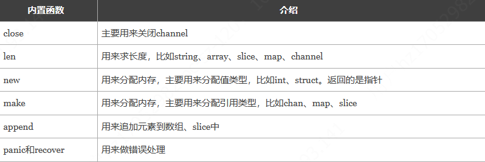
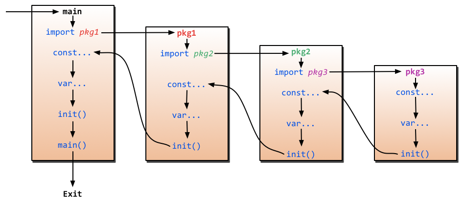

# 1.7.0、函数

每一个程序都包含很多的函数：函数是基本的代码块，并且函数在Go语言中属于“一等公民”。

> *函数是组织好的、可重复使用的、用于执行指定任务的代码块*。

Go是编译型语言，所以函数编写的顺序是无关紧要的；
鉴于可读性的需求，最好把 `main()` 函数写在文件的前面，其他函数按照一定逻辑顺序进行编写（例如函数被调用的顺序）。

编写多个函数的主要目的是将一个需要很多行代码的复杂问题分解为一系列简单的任务（那就是函数）来解决。
而且，同一个任务（函数）可以被调用多次，有助于代码重用。

当函数执行到代码块最后一行（`}` 之前）或者 `return` 语句的时候会退出，其中 `return` 语句可以带有零个或多个参数；
这些参数将作为返回值供调用者使用。简单的 `return` 语句也可以用来结束 `for` 死循环，或者结束一个协程（`goroutine`）。

Go语言中定义函数使用`func`关键字，具体格式如下：
```
func 函数名(参数)(返回值){
    //函数体
    return 返回值列表
}
```

其中：

- 函数名：由字母、数字、下划线组成。但函数名的第一个字母不能是数字。在同一个包内，函数名也称不能重名。函数名首字母小写为私有，大写为公有。

- 参数：参数由参数变量和参数变量的类型组成，参数列表可以有0-多个，多个参数之间使用`,`分隔，不支持默认参数。

- 返回值：返回值由返回值变量和其变量类型组成，也可以只写返回值的类型不写变量名，多个返回值必须用`()`包裹，并用`,`分隔。如果只有一个返回值且不声明类型，可以省略返回值列表与括号。如果有返回值，函数内必须有`return`。

- 函数体：实现指定功能的代码块。

Go中函数常见写法：
```
//无返回值，默认返回0，所以也可以写为 func fn() int {}
func fn(){
    fmt.Println("北凉悲凉，人心不凉")
}

//Go推荐给函数返回值起一个变量名
func fn1() (result int) {
	return 1
}

//第二种返回值写法
func fn2() (result int) {
	result = 1
	return
}

//多返回值
func fn3() (int, int, int) {
   return 1,2,3
}

//Go返回值推荐多返回值写法：
func fn4() (a int, b int, c int) {	多个参数类型如果相同，可以简写为： a,b int
   a , b, c = 1, 2, 3
   return
}

//多个参数
func intSum(x int, y int) int {
	return x + y
}

```

## 函数调用

 定义了函数之后，就通过函数名()的方式调用函数。 例如我们调用上面定义的两个函数，代码如下：
```
func main() {
	fn()
	ret := intSum(10, 20)
	fmt.Println(ret)
}
```
注意，调用有返回值的函数时，可以不接收其返回值。

## 参数

##### 类型简写

函数的参数中如果相邻变量的类型相同，则可以省略类型，例如：
```
func intSum(x, y int) int {
	return x + y
}
```
上面的代码中，`intSum`函数有两个参数，这两个参数的类型均为`int`，因此可以省略 x 的类型，因为 y 后面有类型说明，x 参数也是该类型。

##### 可变参数
可变参数是指函数的参数数量不固定。这个参数长度可以为 0，这样的函数称为变参函数。

Go语言中的可变参数通过在参数名后加`...`来标识。形如：
```
func myFunc(a, b, arg ...int) {}
```

*注意：*可变参数通常要作为函数的最后一个参数。

举个例子：
```
func intSum2(x ...int) int {
	fmt.Println(x) //x是一个切片
	sum := 0
	for _, v := range x {
		sum = sum + v
	}
	return sum
}

在函数体中，变量x，是一个int的slice

//调用上面的函数
ret1 := intSum2()
ret2 := intSum2(10)
ret3 := intSum2(10, 20)
ret4 := intSum2(10, 20, 30)
fmt.Println(ret1, ret2, ret3, ret4) //0 10 30 60
```

固定参数搭配可变参数使用时，可变参数要放在固定参数的后面，示例代码如下：
```
func intSum3(x int, y ...int) int {
	fmt.Println(x, y)
	sum := x
	for _, v := range y {
		sum = sum + v
	}
	return sum
}

//调用上面的函数
ret5 := intSum3(100)
ret6 := intSum3(100, 10)
ret7 := intSum3(100, 10, 20)
ret8 := intSum3(100, 10, 20, 30)
fmt.Println(ret5, ret6, ret7, ret8) //100 110 130 160
```

本质上，函数的可变参数是通过切片来实现的，

如果参数被存储在一个 `slice` 类型的变量 `slice` 中，则可以通过 `slice...` 的形式来传递参数，调用变参函数。
```
package main

import "fmt"

func main() {
	x := min(1, 3, 2, 0)
	fmt.Printf("The minimum is: %d\n", x)
	slice := []int{7,9,3,5,1}
	x = min(slice...)
	fmt.Printf("The minimum in the slice is: %d", x)
}

func min(s ...int) int {
	if len(s)==0 {
		return 0
	}
	min := s[0]
	for _, v := range s {
		if v < min {
			min = v
		}
	}
	return min
}
```

输出如下：
```
The minimum is: 0
The minimum in the slice is: 1
```

变长参数可以作为对应类型的 `slice` 进行二次传递。
但是如果变长参数的类型并不是都相同的呢？使用 5 个参数来进行传递并不是很明智的选择，有 2 种方案可以解决这个问题：

- 使用结构体
- 使用空接口

##### 按值传递（call by value） 按引用传递（call by reference）
Go 默认使用按值传递来传递参数，也就是传递参数的副本。当传一个变量到被调用函数里面时，实际上是传了这个值的一份copy，在使用变量的过程中可能对副本的值进行更改，但不会影响到原来的变量，原变量不会发生任何变化，因为数值变化只作用在copy上。这就是`按值传递`。

示例如下：
```
package main

import "fmt"

//简单的一个函数，实现了参数+1的操作
func add1(a int) int {
	a = a+1 // 我们改变了a的值
	return a //返回一个新值
}

func main() {
	x := 3

	fmt.Println("x = ", x)  // 应该输出 "x = 3"

	x1 := add1(x)  //调用add1(x)

	fmt.Println("x+1 = ", x1) // 应该输出"x+1 = 4"
	fmt.Println("x = ", x)    // 应该输出"x = 3"
}
```

虽然调用了add1函数，并且在add1中执行a = a+1操作，但是上面例子中x变量的值没有发生变化
理由很简单：因为在调用add1的时候，add1接收的参数其实是x的copy，而不是x本身。
如果希望函数可以直接修改参数本身的值，而不是对参数的副本进行操作，就需要将参数的地址（变量名前面添加`&`符号，比如 `&variable`）传递给函数，这就牵扯到了所谓的指针。这就是所谓的`按引用传递`。
变量在内存中是存放于一定地址上的，修改变量实际是修改变量内存地址处的内存。
只有add1函数知道x变量所在的内存地址，才能修改x变量的值。
所以需要将x所在地址`&x`传入函数，并将函数的参数的类型由`int`改为`*int`，即改为指针类型，才能在函数中修改x变量的值。
此时参数仍然是按copy传递的，只是copy的是一个指针。

请看下面的例子

```
package main

import "fmt"

//简单的一个函数，实现了参数+1的操作
func add1(a *int) int { // 请注意，
	*a = *a+1 // 修改了a的值
	return *a // 返回新值
}

func main() {
	x := 3

	fmt.Println("x = ", x)  // 应该输出 "x = 3"

	x1 := add1(&x)  // 调用 add1(&x) 传x的地址

	fmt.Println("x+1 = ", x1) // 应该输出 "x+1 = 4"
	fmt.Println("x = ", x)    // 应该输出 "x = 4"
}
```

这样就达到了修改x的目的。那么到底传指针有什么好处呢？

如果传递给函数的是一个指针，指针的值（一个内存地址）会被复制，但指针的值所指向的内存地址上的值不会被复制；就可以通过这个指针的值来修改这个值所指向的地址上的值。（译者注：指针也是变量类型，有自己的地址和值，通常指针的值指向一个变量的地址。所以，按引用传递也是按值传递。）
几乎在任何情况下，传递指针（一个32位或者64位的值）的消耗都比传递副本来得少。
在函数调用时，像切片（`slice`）、字典（`map`）、接口（`interface`）、通道（`channel`）这样的引用类型都是默认使用引用传递（即使没有显式的指出指针）。
有些函数只是完成一个任务，并没有返回值。我们仅仅是利用了这种函数的副作用，就像输出文本到终端，发送一个邮件或者是记录一个错误等。
但是绝大部分的函数还是带有返回值的。


###### 总结：
- 传指针使得多个函数能操作同一个对象。
- 传指针比较轻量级 (`8bytes`),只是传内存地址，我们可以用指针传递体积大的结构体。如果用参数值传递的话, 在每次copy上面就会花费相对较多的系统开销（内存和时间）。所以在要传递大的结构体的时候，用指针是一个明智的选择。
- Go语言中`channel`，`slice`，`map`这三种类型的实现机制类似指针，所以可以直接传递，而不用取地址后传递指针
*注：* 若函数需改变`slice`的长度，则仍需要取地址传递指针


## 返回值
Go语言中通过`return`关键字向外输出返回值。
事实上，任何一个有返回值（单个或多个）的函数都必须以 `return` 或 `panic`结尾。
在函数块里面，`return` 之后的语句都不会执行。如果一个函数需要返回值，那么这个函数里面的每一个代码分支（code-path）都要有 `return` 语句。

##### 多返回值

Go语言中函数支持多返回值，函数如果有多个返回值时必须用`()`将所有返回值包裹起来。
```
func calc(x, y int) (int, int) {
	sum := x + y
	sub := x - y
	return sum, sub
}
```

##### 返回值命名

函数定义时可以给返回值命名，并在函数体中直接使用这些变量，最后通过 `return`关键字返回
```
func calc(x, y int) (sum, sub int) {
	sum = x + y
	sub = x - y
	return
}
```

##### 返回值补充

当我们的一个函数返回值类型为`slice`时，`nil`可以看做是一个有效的`slice`，没必要显示返回一个长度为0的切片。
```
func someFunc(x string) []int {
	if x == "" {
		return nil // 没必要返回[]int{}
	}
	...
}
```
任何一个非命名返回值（使用非命名返回值是很糟的编程习惯）在 `return` 语句里面都要明确指出包含返回值的变量或是一个可计算的值


## 变量作用域

##### 全局变量

全局变量是定义在函数外部的变量，它在程序整个运行周期内都有效。 在函数中可以访问到全局变量。

```
package main

import "fmt"

//定义全局变量num
var num int64 = 10

func testGlobalVar() {
	fmt.Printf("num=%d\n", num) //函数中可以访问全局变量num
}
func main() {
	testGlobalVar() //num=10
}
```

##### 局部变量
局部变量又分为两种： 
    
1、函数内定义的变量无法在该函数外使用，例如下面的示例代码`main`函数中无法使用testLocalVar函数中定义的变量x：
```
func testLocalVar() {
	//定义一个函数局部变量x,仅在该函数内生效
	var x int64 = 100
	fmt.Printf("x=%d\n", x)
}

func main() {
	testLocalVar()
	fmt.Println(x) // 此时无法使用变量x
}
```

如果局部变量和全局变量重名，优先访问局部变量。
```
package main

import "fmt"

//定义全局变量num
var num int64 = 10

func testNum() {
	num := 100
	fmt.Printf("num=%d\n", num) // 函数中优先使用局部变量
}
func main() {
	testNum() // num=100
}

```

2、语句块定义的变量，通常我们会在if条件判断、for循环、switch语句上使用这种定义变量的方式。
```
func testLocalVar2(x, y int) {
	fmt.Println(x, y) //函数的参数也是只在本函数中生效
	if x > 0 {
		z := 100 //变量z只在if语句块生效
		fmt.Println(z)
	}
	//fmt.Println(z)//此处无法使用变量z
}

func testLocalVar3() {
	for i := 0; i < 10; i++ {
		fmt.Println(i) //变量i只在当前for语句块中生效
	}
	//fmt.Println(i) //此处无法使用变量i
}
```


## 函数类型与变量

##### 定义函数类型

使用`type`关键字来定义一个函数类型，具体格式如下：
```
type calculation func(int, int) int
```
上面语句定义了一个 calculation 类型，它是一种函数类型，这种函数接收两个`int`类型的参数并且返回一个`int`类型的返回值。

简单来说，凡是满足这个条件的函数都是calculation类型的函数，例如下面的add和sub是calculation类型。

```
func add(x, y int) int {
	return x + y
}

func sub(x, y int) int {
	return x - y
}
```
add和sub都能赋值给calculation类型的变量。
```
var c calculation
c = add
```

##### 函数类型变量
可以声明函数类型的变量并且为该变量赋值：
```
func main() {
	var c calculation               // 声明一个calculation类型的变量c
	c = add                         // 把add赋值给c
	fmt.Printf("type of c:%T\n", c) // type of c:main.calculation
	fmt.Println(c(1, 2))            // 像调用add一样调用c

	f := add                        // 将函数add赋值给变量f1
	fmt.Printf("type of f:%T\n", f) // type of f:func(int, int) int
	fmt.Println(f(10, 20))          // 像调用add一样调用f
}
```


## 递归函数

当一个函数在其函数体内调用自身，则称之为递归。最经典的例子便是计算斐波那契数列，即前两个数为1，从第三个数开始每个数均为前两个数之和。

数列如下所示：
```
1, 1, 2, 3, 5, 8, 13, 21, 34, 55, 89, 144, 233, 377, 610, 987, 1597, 2584, 4181, 6765, 10946, …
```

下面的程序可用于生成该数列
```
package main

import "fmt"

func main() {
	result := 0
	for i := 0; i <= 10; i++ {
		result = fibonacci(i)
		fmt.Printf("fibonacci(%d) is: %d\n", i, result)
	}
}

func fibonacci(n int) (res int) {
	if n <= 1 {
		res = 1
	} else {
		res = fibonacci(n-1) + fibonacci(n-2)
	}
	return
}
```

输出如下：
```
fibonacci(0) is: 1
fibonacci(1) is: 1
fibonacci(2) is: 2
fibonacci(3) is: 3
fibonacci(4) is: 5
fibonacci(5) is: 8
fibonacci(6) is: 13
fibonacci(7) is: 21
fibonacci(8) is: 34
fibonacci(9) is: 55
fibonacci(10) is: 89
```


在使用递归函数时经常会遇到的一个重要问题就是栈溢出：一般出现在大量的递归调用导致的程序栈内存分配耗尽。这个问题可以通过一个名为懒惰求值的技术解决，在 Go 语言中，我们可以使用管道（`channel`）和 `goroutine`来实现。

Go 语言中也可以使用相互调用的递归函数：多个函数之间相互调用形成闭环。因为 Go 语言编译器的特殊性，这些函数的声明顺序可以是任意的。
下面这个简单的例子展示了函数 odd 和 even 之间的相互调用

```
package main

import (
	"fmt"
)

func even(nr int) bool {
	if nr == 0 {
		return true
	}
	return odd(RevSign(nr) - 1)
}

func odd(nr int) bool {
	if nr == 0 {
		return false
	}
	return even(RevSign(nr) - 1)
}

func RevSign(nr int) int {
	if nr < 0 {
		return -nr
	}
	return nr
}

func main() {
	fmt.Printf("%d is even: is %t\n", 16, even(16)) // 16 is even: is true
	fmt.Printf("%d is odd: is %t\n", 17, odd(17))
	// 17 is odd: is true
	fmt.Printf("%d is odd: is %t\n", 18, odd(18))
	// 18 is odd: is false
}

```

## 高阶函数
高阶函数分为函数作为参数和函数作为返回值两部分。

##### 函数作为参数
函数可以作为其它函数的参数进行传递，然后在其它函数内调用执行，一般称之为回调。
```
func add(x, y int) int {
	return x + y
}
func calc(x, y int, op func(int, int) int) int {
	return op(x, y)
}
func main() {
	ret2 := calc(10, 20, add)
	fmt.Println(ret2) //30
}
```

如果一个函数需要返回四到五个值，我们可以传递一个切片给函数（如果返回值具有相同类型）或者是传递一个结构体（如果返回值具有不同的类型）。因为传递一个指针允许直接修改变量的值，消耗也更少。
```
package main

import "fmt"

type testInt func(int) bool // 声明了一个函数类型

func isOdd(integer int) bool {
	if integer%2 == 0 {
		return false
	}
	return true
}

func isEven(integer int) bool {
	if integer%2 == 0 {
		return true
	}
	return false
}

// 声明的函数类型在这个地方当做了一个参数

func filter(slice []int, f testInt) []int {
	var result []int
	for _, value := range slice {
		if f(value) {
			result = append(result, value)
		}
	}
	return result
}

func main(){
	slice := []int {1, 2, 3, 4, 5, 7}
	fmt.Println("slice = ", slice)
	odd := filter(slice, isOdd)    // 函数当做值来传递了
	fmt.Println("Odd elements of slice are: ", odd)
	even := filter(slice, isEven)  // 函数当做值来传递了
	fmt.Println("Even elements of slice are: ", even)
}
```

函数当做值和类型在写一些通用接口的时候非常有用，通过上面例子可以看到testInt这个类型是一个函数类型，然后两个filter函数的参数和返回值与testInt类型是一样的，但是我们可以实现很多种的逻辑，这样使得程序变得非常的灵活。

##### 函数作为返回值
函数也可以作为返回值：
```
func do(s string) (func(int, int) int, error) {
	switch s {
	case "+":
		return add, nil
	case "-":
		return sub, nil
	default:
		err := errors.New("无法识别的操作符")
		return nil, err
	}
}
```

## 匿名函数
函数当然还可以作为返回值，但是在Go语言中函数内部不能再像之前那样定义函数了，只能定义匿名函数。

匿名函数就是没有函数名的函数，匿名函数的定义格式如下：
```
func(参数)(返回值){
    函数体
}
```

匿名函数因为没有函数名，所以没办法像普通函数那样调用，所以匿名函数需要保存到某个变量或者作为立即执行函数:
```
func main() {
	// 将匿名函数保存到变量
	add := func(x, y int) {
		fmt.Println(x + y)
	}
	add(10, 20) // 通过变量调用匿名函数

	//自执行函数：匿名函数定义完加()直接执行
	func(x, y int) {
		fmt.Println(x + y)
	}(10, 20)
}
```

匿名函数多用于实现回调函数和闭包。


## 闭包
闭包指的是一个函数和与其相关的引用环境组合而成的实体。

简单来说，闭包=函数+引用环境。示例如下：
```
func adder() func(int) int {
	var x int
	return func(y int) int {
		x += y
		return x
	}
}
func main() {
	var f = adder()
	fmt.Println(f(10)) //10
	fmt.Println(f(20)) //30
	fmt.Println(f(30)) //60

	f1 := adder()
	fmt.Println(f1(40)) //40
	fmt.Println(f1(50)) //90
}
```

变量f是一个函数并且它引用了其外部作用域中的x变量，此时f就是一个闭包。 在f的生命周期内，变量x也一直有效。
闭包示例1：
```
func adder2(x int) func(int) int {
	return func(y int) int {
		x += y
		return x
	}
}
func main() {
	var f = adder2(10)
	fmt.Println(f(10)) //20
	fmt.Println(f(20)) //40
	fmt.Println(f(30)) //70

	f1 := adder2(20)
	fmt.Println(f1(40)) //60
	fmt.Println(f1(50)) //110
}
```

闭包示例2：

```
func makeSuffixFunc(suffix string) func(string) string {
	return func(name string) string {
		if !strings.HasSuffix(name, suffix) {
			return name + suffix
		}
		return name
	}
}

func main() {
	jpgFunc := makeSuffixFunc(".jpg")
	txtFunc := makeSuffixFunc(".txt")
	fmt.Println(jpgFunc("test")) //test.jpg
	fmt.Println(txtFunc("test")) //test.txt
}
```

闭包示例3：
```
func calc(base int) (func(int) int, func(int) int) {
	add := func(i int) int {
		base += i
		return base
	}

	sub := func(i int) int {
		base -= i
		return base
	}
	return add, sub
}

func main() {
	f1, f2 := calc(10)
	fmt.Println(f1(1), f2(2)) //11 9
	fmt.Println(f1(3), f2(4)) //12 8
	fmt.Println(f1(5), f2(6)) //13 7
}
```
闭包其实并不复杂，只要牢记闭包=函数+引用环境


## 通过内存缓存来提升性能

当在进行大量的计算时，提升性能最直接有效的一种方式就是避免重复计算。通过在内存中缓存和重复利用相同计算的结果，称之为内存缓存。最明显的例子就是生成斐波那契数列的程序

要计算数列中第 n 个数字，需要先得到之前两个数的值，但很明显绝大多数情况下前两个数的值都是已经计算过的。即每个更后面的数都是基于之前计算结果的重复计算。

而我们要做就是将第 n 个数的值存在数组中索引为 n 的位置，然后在数组中查找是否已经计算过，如果没有找到，则再进行计算。


```
package main

import (
	"fmt"
	"time"
)

const LIM = 41

var fibs [LIM]uint64

func main() {
	var result uint64 = 0
	start := time.Now()
	for i := 0; i < LIM; i++ {
		result = fibonacci(i)
		fmt.Printf("fibonacci(%d) is: %d\n", i, result)
	}
	end := time.Now()
	delta := end.Sub(start)
	fmt.Printf("longCalculation took this amount of time: %s\n", delta)
}
func fibonacci(n int) (res uint64) {
	// memoization: check if fibonacci(n) is already known in array:
	if fibs[n] != 0 {
		res = fibs[n]
		return
	}
	if n <= 1 {
		res = 1
	} else {
		res = fibonacci(n-1) + fibonacci(n-2)
	}
	fibs[n] = res
	return
}
```

下面是计算到第 40 位数字的性能对比：

- 普通写法：4.730270 秒
- 内存缓存：0.001000 秒
内存缓存的优势显而易见，而且您还可以将它应用到其它类型的计算中，例如使用 `map`而不是数组或切片

内存缓存的技术在使用计算成本相对昂贵的函数时非常有用（不仅限于例子中的递归），譬如大量进行相同参数的运算。这种技术还可以应用于纯函数中，即相同输入必定获得相同输出的函数。


### 内置函数介绍


## 异常机制：panic/recover

Go语言中目前是没有异常机制，但是使用`panic/recover`模式来处理错误。
`panic`可以在任何地方引发，但`recover`只有在`defer`调用的函数中有效。 
手动触发异常，是非常简单的一件事，只需要调用 `panic` 这个内置函数即可。

Panic
>`panic`是一个内建函数，可以中断原有的控制流程，进入一个`panic`状态中。
>当函数 F 调用`panic`，函数F的执行被中断，但是F中的延迟函数会正常执行，然后F返回到调用它的地方。
>在调用的地方，F的行为就像调用了`panic`。这一过程继续向上，直到发生`panic`的`goroutine`中所有调用的函数返回，此时程序退出。
>`panic`可以直接调用`panic`产生。也可以由运行时错误产生，例如访问越界的数组。


首先来看一个例子：

```
func funcA() {
	fmt.Println("func A")
}

func funcB() {
	panic("panic in B")
}

func funcC() {
	fmt.Println("func C")
}
func main() {
	funcA()
	funcB()
	funcC()
}
```

结果输出如下：
```func A
panic: panic in B

goroutine 1 [running]:
main.funcB(...)
        .../code/func/main.go:12
main.main()
        .../code/func/main.go:20 +0x98
```


##### 捕获panic
程序运行期间funcB中引发了`panic`导致程序崩溃，异常退出了。这个时候我们就可以通过`recover`将程序恢复回来，继续往后执行。

Recover
>`recover`是一个内建的函数，可以让进入`panic`状态的`goroutine`恢复过来。
>`recover`仅在延迟函数中有效。
>在正常的执行过程中，调用`recover`会返回`nil`，并且没有其它任何效果。
>如果当前的`goroutine`陷入`panic`状态，调用`recover`可以捕获到`panic`的输入值，并且恢复正常的执行。


```
func funcA() {
	fmt.Println("func A")
}

func funcB() {
	defer func() {
		err := recover()
		//如果程序出出现了panic错误,可以通过recover恢复过来
		if err != nil {
			fmt.Println("recover in B")
		}
	}()
	panic("panic in B")
}

func funcC() {
	fmt.Println("func C")
}
func main() {
	funcA()
	funcB()
	funcC()
}
```

注意：

- `recover()`必须搭配`defer`使用。其他作用域下，它是不工作的。。
- `defer`一定要在可能引发`panic`的语句之前定义。

通常来说，不应该对进入 `panic` 异常的程序做任何处理，但有时，需要我们可以从宕机中恢复，至少我们可以在程序崩溃前，做一些操作，举个例子，当 web 服务器遇到不可预料的严重问题时，在崩溃前应该将所有的连接关闭，如果不做任何处理，会使得客户端一直处于等待状态，如果 web 服务器还在开发阶段，服务器甚至可以将异常信息反馈到客户端，帮助调试。


##### 无法跨协程
从上面的例子，可以看到，即使 panic 会导致整个程序退出，但在退出前，若有 defer 延迟函数，还是得执行完 defer 。

但是这个 defer 在多个协程之间是没有效果，在子协程里触发 panic，只能触发自己协程内的 defer，而不能调用 main 协程里的 defer 函数的。

```
import (
    "fmt"
    "time"
)

func main() {
    // 这个 defer 并不会执行
    defer fmt.Println("in main")

    go func() {
        defer println("in goroutine")
        panic("")
    }()

    time.Sleep(2 * time.Second)
}
```

输出如下:
```
in goroutine
panic:

goroutine 6 [running]:
main.main.func1()
        E:/Go-Code/main.go:12 +0x7b
created by main.main
        E:/Go-Code/main.go:10 +0xbc
exit status 2
```

##### 总结

Golang 异常的抛出与捕获，依赖两个内置函数：

- `panic`：抛出异常，使程序崩溃
- `recover`：捕获异常，恢复程序或做收尾工作

`revocer` 调用后，抛出的 `panic` 将会在此处终结，不会再外抛，但是 `recover`，并不能任意使用，它有强制要求，必须得在 `defer` 下才能发挥用途。

## main函数和init函数

Go里面有两个保留的函数：`init`函数（能够应用于所有的`package`）和`main`函数（只能应用于`package main`）。这两个函数在定义时不能有任何的参数和返回值。虽然一个`package`里面可以写任意多个`init`函数，但这无论是对于可读性还是以后的可维护性来说，都强烈建议在一个`package`中每个文件只写一个init函数。

Go程序会自动调用`init()`和`main()`，所以不需要在任何地方调用这两个函数。每个`package`中的`init`函数都是可选的，但`package main`就必须包含一个`main`函数。

程序的初始化和执行都起始于`main`包。如果`main`包还导入了其它的包，那么就会在编译时将它们依次导入。有时一个包会被多个包同时导入，那么它只会被导入一次（例如很多包可能都会用到`fmt`包，但它只会被导入一次，因为没有必要导入多次）。当一个包被导入时，如果该包还导入了其它的包，那么会先将其它包导入进来，然后再对这些包中的包级常量和变量进行初始化，接着执行`init`函数（如果有的话），依次类推。等所有被导入的包都加载完毕了，就会开始对`main`包中的包级常量和变量进行初始化，然后执行`main`包中的`init`函数（如果存在的话），最后执行`main`函数。下图详细地解释了整个执行过程：


#### import
在写`Go`代码的时候经常用到`import`这个命令用来导入包文件，而我们经常看到的方式参考如下：
```
import(
    "fmt"
)
```

然后我们代码里面可以通过如下的方式调用
```
fmt.Println("hello world")
```

上面这个`fmt`是`Go`语言的标准库，其实是去`GOROOT`环境变量指定目录下去加载该模块，当然`Go`的`import`还支持如下两种方式来加载自己写的模块：

- 相对路径
```
import “./model” //当前文件同一目录的model目录，但是不建议这种方式来import
```
- 绝对路径
```
import "shorturl/model" //加载gopath/src/shorturl/model模块
```
上面展示了一些import常用的几种方式，但是还有一些特殊的import。

- 点操作
我们有时候会看到如下的方式导入包
```
import(
    . "fmt"
)
```
这个点操作的含义就是这个包导入之后在调用这个包的函数时，可以省略前缀的包名，也就是前面调用的`fmt.Println("hello world")`可以省略的写成`Println("hello world")`

- 别名操作
别名操作顾名思义我们可以把包命名成另一个用起来容易记忆的名字
```
import(
    f "fmt"
)
```
别名操作的话调用包函数时前缀变成了前缀，即`f.Println("hello world")`

- `_`操作
这个操作经常是让很多人费解的一个操作符，请看下面这个`import`

```
import (
	 "database/sql"
	 _ "github.com/ziutek/mymysql/godrv"
)
```

`_`操作其实是引入该包，而不直接使用包里面的函数，而是调用了该包里面的init函数。

